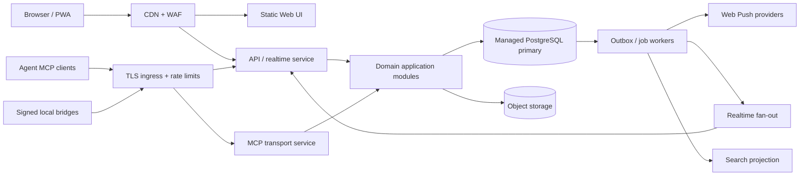
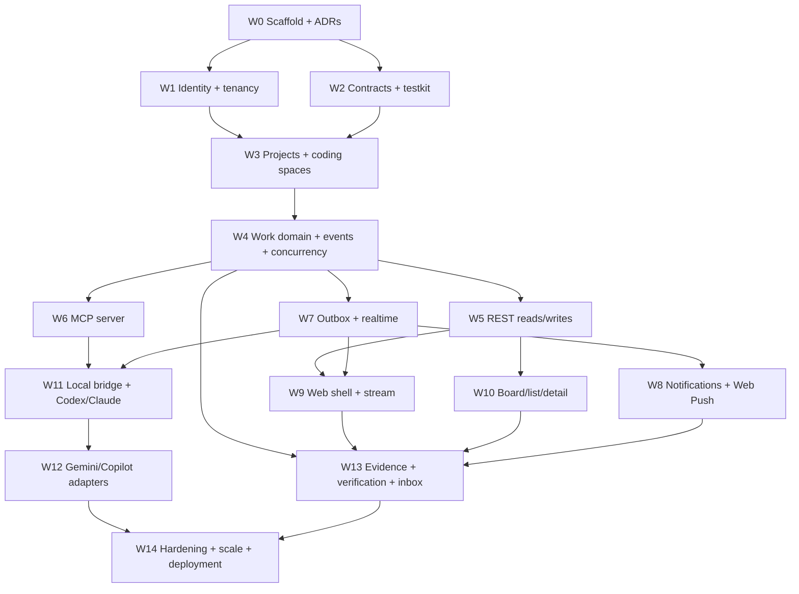

# Unified Agent Work Tracker — Canonical Product and Implementation Plan

Status: canonical implementation specification  
Date: 2026-08-09  
Working name: **Relayboard** (placeholder)

This is the single source of truth for product behavior, Web UI/UX, domain semantics, MCP behavior, provider integrations, backend infrastructure, concurrency, deployment, security, reliability, testing, and delivery sequencing. An implementation agent should read this document before changing architecture or beginning a work package. If code and this document disagree, stop and either update the applicable architecture decision record or revise this document intentionally; do not silently create a second design.

## 0. How implementation agents should use this document

### 0.1 Reading order

Before implementing a work package, read:

1. Sections 1–3 for the product promise and invariants.
2. Section 5 for domain semantics and concurrency fields.
3. Section 7 for MCP contracts if the package touches agents.
4. Sections 8 and 9 for provider behavior or UI work.
5. Sections 10–16 for infrastructure, security, reliability, and tests.
6. Sections 17–22 for sequencing and acceptance criteria.
7. Appendices A–F for normative implementation details and edge cases.

### 0.2 Normative language

- **Must** means required for correctness, security, interoperability, or the stated user experience.
- **Should** means the default; deviations require a short architecture decision record.
- **May** means optional and can be deferred.
- “Interaction” means one user prompt plus the resulting agent turn, including tool calls and the final/stop outcome.
- “Unified todo stream” means the chronological, project-wide activity surface. It is not a raw transcript and is not an agent chat input.
- “Coding space” means one concrete working context: repository clone, worktree, dev container, remote workspace, codespace, or local project directory.

### 0.3 Non-negotiable implementation invariants

1. There is exactly one canonical task identity per accepted work item within a project.
2. Every accepted mutation has an actor, provider/source, interaction or request identity, timestamp, and immutable event.
3. No concurrent write silently overwrites another write.
4. No notification is sent before its corresponding database transaction commits.
5. Redelivered provider hooks, MCP calls, queue jobs, or webhook events cannot create duplicate domain mutations.
6. An agent completion claim is not equivalent to verified completion.
7. A passive provider event is never mislabeled as an explicit MCP update.
8. An inferred task or status is not authoritative until policy or a human accepts it.
9. A project is never resolved from directory basename alone.
10. UI, MCP, REST, background jobs, and adapters all invoke the same domain command handlers.
11. Tenant authorization is applied before every query and mutation, including search, caches, and realtime subscriptions.
12. The system continues to accept canonical MCP/API/UI work if one provider adapter or notification channel is down.

### 0.4 Product layout in one sentence

The application should feel familiar to Codex or Claude Code: a narrow project/directory sidebar, a source/session sidebar scoped to the selected project, and a spacious main surface—but the main surface is a unified todo stream and structured task workspace rather than another model conversation.

## 1. Executive summary

Relayboard is a project-aware work tracker built for people using multiple AI-agent chats at the same time. It gives every project one durable view of what is proposed, planned, ready, active, blocked, awaiting review, completed, or abandoned—without losing which agent, chat, turn, person, or artifact caused each change.

The product has three distinct responsibilities:

1. **System of record:** a durable task graph with history, provenance, dependencies, evidence, and optimistic concurrency.
2. **Agent interface:** an MCP server that every compatible agent can use to read project context and record work consistently.
3. **Capture adapters:** vendor-specific integrations for Codex, Claude Code, and later other agents. These collect metadata and events that MCP alone cannot observe.

MCP is the shared interoperability surface, not the database and not a passive chat recorder. An MCP server only sees calls an agent makes to it. Reliable automatic capture therefore needs a layered approach:

- explicit MCP tools for authoritative task mutations;
- server instructions and project guidance that tell agents when to call those tools;
- provider hooks/event streams for best-effort automatic lifecycle capture;
- optional import/summarization for old chats, with user review before inferred tasks become authoritative.

The recommended first release is a **modular monolith**: React web/PWA, TypeScript API and MCP server, PostgreSQL, an outbox worker, and realtime updates over WebSocket or SSE. This keeps the first version fast to build and simple to operate while preserving clean module boundaries for later service extraction.

## 2. Product definition

### 2.1 Problem

When a developer works across several Codex, Claude, or other agent conversations:

- plans are fragmented across chat histories;
- one chat cannot reliably see tasks created in another;
- agents say work is complete without recording proof or downstream work;
- duplicated or contradictory tasks accumulate;
- blockers and dependency chains are not visible;
- switching tools loses source context;
- humans spend time reconstructing state rather than making decisions.

Traditional todo apps assume a person manually maintains the list. Traditional issue trackers are too heavy and usually capture only intentional, finalized work. Relayboard should sit between these: low-friction enough for continuous agent use, but structured and trustworthy enough to become project memory.

### 2.2 Product promise

> Open any agent or the Relayboard UI and immediately know what the project intends to do, what is happening now, what is blocked, what changed, why it changed, who or what changed it, and what evidence supports completion.

### 2.3 North-star outcome

Within 30 seconds, a user returning to a project after a day away can answer:

- What changed?
- What is being worked on?
- What needs my decision?
- What is blocked, and by what?
- What did each agent complete?
- Which claims are verified versus merely reported?

### 2.4 Non-goals for the first version

- replacing GitHub Issues, Linear, Jira, or project-management suites;
- storing full raw chat transcripts by default;
- silently interpreting every sentence as a task;
- automatically merging semantically similar work without confirmation;
- orchestrating or executing arbitrary coding agents;
- using an LLM as the source of truth for task state;
- microservices, Kafka, Elasticsearch, or CRDTs before scale requires them.

## 3. Product principles

1. **One project truth, many sources.** Agents can disagree, but the project state remains singular and inspectable.
2. **Provenance is first-class.** Every mutation answers who, where, when, why, and through which integration.
3. **Events are immutable; views are mutable.** Current task state is a projection of an append-only activity history.
4. **Claims differ from proof.** “Agent says done” and “tests passed in commit X” are different states.
5. **Human authority is explicit.** Agents can act within policy; sensitive or ambiguous transitions can require review.
6. **Dependencies form a graph.** Blockers are edges, not free-text labels.
7. **Fast paths stay fast.** Creating, starting, and completing work should each take one agent tool call.
8. **Interoperability first.** The domain model is provider-neutral; Codex and Claude details live in adapters.
9. **Progressive disclosure.** The default UI is calm; history, evidence, and raw source data are one click deeper.
10. **Degrade gracefully.** If an adapter is offline, explicit MCP use and the UI still work.

## 4. Primary users and jobs

### 4.1 Solo multi-agent developer

Uses several local or cloud chats on the same repository. Needs unified project memory and source attribution without issue-tracker ceremony.

### 4.2 Technical lead

Delegates work across agents and people. Needs dependency visibility, confidence in completion, decision queues, and an audit trail.

### 4.3 Small engineering team

Shares projects and agent integrations. Needs roles, tenant isolation, conflict handling, notifications, and external issue links.

### 4.4 Core jobs to be done

- Capture a task from any agent conversation.
- See all current work for a project regardless of origin.
- Give a new chat a compact, current project briefing.
- Start, block, resume, review, complete, reopen, or cancel work.
- Trace a task back to its source chat/turn and resulting commit, PR, test, or file.
- Detect duplicate, stale, conflicting, or unowned work.
- Review changes inferred automatically from chat activity.
- Hand work from one agent to another without losing context.

## 5. Domain model

### 5.1 Main entities

#### Organization

Security and billing boundary. A solo user still has a personal organization.

Fields: `id`, `name`, `slug`, `plan`, `created_at`.

#### Workspace

Collection of related projects and members.

Fields: `id`, `organization_id`, `name`, `settings`, `created_at`.

#### Project

The canonical unit of context. May map to one repository, a monorepo slice, or a non-code initiative.

Fields:

- `id`, stable UUID/ULID;
- `workspace_id`;
- `name`, `slug`, `description`;
- `repo_fingerprints[]`: normalized Git remote, local root fingerprint, optional repository ID;
- `default_branch`;
- `status` (`active`, `paused`, `archived`);
- `settings`: policies, required evidence, allowed agent actions;
- `created_by`, timestamps.

#### Work item

The canonical todo. “Task” is the initial item type, but the schema should support `epic`, `task`, `bug`, `decision`, and `follow_up`.

Fields:

- `id`, `project_id`, optional `parent_id`;
- human-friendly project sequence, e.g. `RB-142`;
- `type`, `title`, rich `description`;
- `lifecycle_status`;
- `priority` (`urgent`, `high`, `normal`, `low`, `none`);
- optional `assignee_actor_id` and `owner_user_id`;
- `created_by_actor_id`, `last_changed_by_actor_id`;
- `planned_start_at`, `due_at`, `started_at`, `completed_at`, `cancelled_at`;
- `completion_confidence` and `verification_status`;
- `version` for optimistic concurrency;
- `archived_at`, timestamps.

#### Actor

Normalized identity behind a change.

Types: `human`, `agent`, `automation`, `integration`, `system`.

Fields: `id`, `organization_id`, `type`, `display_name`, `provider`, `model`, `installation_id`, `external_actor_id`, metadata.

Do not equate a model name with an actor. A Codex task, a Claude Code session, and an automated summarizer using the same model are separate actors or actor sessions.

#### Source

Where a work item or event came from.

Types: `codex_thread`, `claude_session`, `chat`, `mcp_call`, `ui`, `api`, `git`, `github`, `linear`, `import`, `automation`.

Fields:

- `id`, `project_id`, `provider`, `type`;
- `external_id`, `external_parent_id`;
- optional `title`, `url`, `local_reference`;
- `started_at`, `last_seen_at`;
- privacy level and retention policy;
- provider metadata.

Unique key: `(project_id, provider, type, external_id)` when an external ID exists.

#### Source reference

Many-to-many link between a work item/event and a source location.

Fields: `work_item_id`, `source_id`, optional `turn_id`, `message_id`, `tool_call_id`, `quote_excerpt`, `relation` (`origin`, `discussed`, `updated`, `evidence`, `handoff`), timestamp.

Excerpts should be short and configurable; do not store entire conversations by default.

#### Work event

Immutable append-only record of every accepted domain mutation.

Examples: `work_item.created`, `status.changed`, `dependency.added`, `evidence.attached`, `description.revised`, `claim.completed`, `completion.verified`, `assignment.changed`, `item.merged`, `item.reopened`.

Fields: `id`, `organization_id`, `project_id`, `work_item_id`, `event_type`, `actor_id`, `source_id`, `request_id`, `idempotency_key`, `occurred_at`, `recorded_at`, `base_version`, `result_version`, `payload`, `schema_version`.

The regular relational tables hold current projections for fast queries. The event table supplies audit, history, replay, and eventual downstream integrations; this is event-assisted CRUD, not full event sourcing.

#### Dependency

Directed typed edge between work items.

Types:

- `blocks`: target cannot progress until source is resolved;
- `requires`: target needs source, but may still progress partially;
- `relates_to`;
- `duplicates`;
- `supersedes`.

Fields: `from_work_item_id`, `to_work_item_id`, `type`, `created_by`, optional reason, timestamps.

Reject self-edges. For blocking/required edges, detect cycles on write and require explicit override for exceptional cases.

#### Evidence

Proof or context attached to work.

Types: `commit`, `pull_request`, `test_run`, `command`, `file_change`, `deployment`, `url`, `note`, `artifact`, `agent_claim`.

Fields: `id`, `work_item_id`, `type`, `uri`, `label`, `result`, `source_id`, `actor_id`, checksum/metadata, timestamps.

#### Agent installation

Connection and policy for an agent/provider.

Fields: `id`, `workspace_id`, `provider`, `transport`, `status`, encrypted credential reference, capabilities, last heartbeat, version, settings.

### 5.2 Lifecycle state machine

Use one canonical lifecycle dimension:

```text
proposed -> planned -> ready -> in_progress -> in_review -> done
    |          |         |          |             |          |
    +----------+---------+----------+-------------+------> cancelled
                              |
                              +----> blocked ----> in_progress / ready

done -> reopened -> ready / in_progress
```

Semantics:

- `proposed`: captured idea or inferred action; not yet committed.
- `planned`: accepted into scope but not necessarily actionable.
- `ready`: actionable and unblocked.
- `in_progress`: an actor has actively started it.
- `blocked`: cannot proceed; must have at least one unresolved blocker or a structured blocker reason.
- `in_review`: implementation or answer exists and awaits human/automated verification.
- `done`: completion policy is satisfied.
- `cancelled`: intentionally abandoned, rejected, or no longer relevant.

“Yet to be done” is a UI grouping spanning `planned` and `ready`, not another database status. “Reopened” is an event, not a permanent status.

### 5.3 Completion and verification

Avoid a binary interpretation of done. Track:

- `completion_confidence`: `reported`, `supported`, `verified`;
- `verification_status`: `not_required`, `pending`, `passed`, `failed`, `waived`.

Example policy:

- an agent calls `report_completion` with summary and evidence → `in_review`, confidence `reported` or `supported`;
- CI/test adapter verifies required checks → `done`, confidence `verified`;
- a human can accept, reject, waive, or reopen.

Projects may choose “trust agent completion” for low-risk personal use, but the evidence remains visible.

### 5.4 Blockers

A blocked item should contain either:

- one or more dependency edges to unresolved work items; or
- a structured external blocker with `kind`, `summary`, optional owner, requested input, and recheck date.

Kinds: `dependency`, `human_decision`, `missing_requirement`, `permission`, `external_service`, `environment`, `unknown`.

Resolving all hard blockers does not silently start work. It changes the item to `ready` and emits a notification.

### 5.5 Identity and deduplication

Three layers prevent duplicates:

1. **Request idempotency:** every write accepts an idempotency key, unique within an installation/project.
2. **Provider identity:** external chat, turn, tool-call, issue, commit, and PR IDs are stored under provider-scoped unique constraints.
3. **Semantic duplicate suggestions:** asynchronous similarity detection proposes likely duplicates based on normalized title, description embedding, shared source, file scope, and dependency neighborhood.

Never auto-merge merely because embeddings are similar. A merge preserves aliases and all source references and emits an auditable `item.merged` event.

### 5.6 Concurrency rules

- Every work item has a monotonically increasing `version`.
- Mutation tools accept optional `expected_version`.
- Safe additive operations, such as adding a new evidence record, can retry automatically.
- Conflicting replacements return a structured conflict with current value, attempted value, changed fields, and latest version.
- Status transitions use row locks inside a short database transaction.
- Agent comments/updates remain append-only and do not overwrite human-authored descriptions.

## 6. End-to-end user journeys

### 6.1 First project setup

1. User creates or detects a project from a repository.
2. App computes repository fingerprints and offers to reuse an existing project.
3. User connects the hosted MCP endpoint or installs the local stdio bridge in Codex and Claude Code.
4. App shows provider-specific setup snippets and verifies a test call.
5. Project guidance tells agents to retrieve a briefing at the start of substantial work and update lifecycle state as work changes.
6. The dashboard starts empty with an onboarding checklist and live connection status.

### 6.2 Agent creates a plan

1. Agent calls `get_project_brief` to avoid duplicate planning.
2. Agent calls `create_work_items` once with a plan, dependencies, and source metadata.
3. Server validates, deduplicates by idempotency key, creates items/events in one transaction, and returns compact IDs.
4. UI receives an outbox event and animates the new cards into the plan review lane.
5. User accepts all, edits, or rejects proposed tasks.

### 6.3 Agent starts and completes work

1. Agent calls `start_work` with task ID and expected version.
2. Task becomes `in_progress`, actor ownership and source thread are recorded.
3. During work, the agent may attach progress notes or new child tasks.
4. Agent calls `report_completion` with summary, evidence, tests, and follow-ups.
5. Server moves the item to `in_review` or `done` according to project policy.
6. Git/CI adapters enrich evidence asynchronously.

### 6.4 Another chat joins the same project

1. It calls `get_project_brief` using project/repository identity.
2. Response contains goals, active work, ready work, blockers, recent decisions, and task IDs within a bounded token budget.
3. The agent can claim an unowned ready task or create a related task.
4. Conflicting claims are rejected or turned into a collaboration/handoff based on policy.

### 6.5 Agent becomes blocked

1. Agent calls `block_work` with blocker task IDs or a structured external blocker.
2. Server checks graph validity, emits events, and marks the item blocked.
3. UI places it in the blocked lane and surfaces the shortest blocking chain.
4. The responsible human/agent gets an inbox item.
5. When blockers resolve, the item becomes ready and relevant sources are notified where supported.

### 6.6 Historical chat import

1. Adapter imports chat/session metadata and selected message content under a user-approved retention scope.
2. Extraction creates **candidate** work items and completion claims, not canonical mutations.
3. Review UI groups candidates by chat with source excerpts and confidence.
4. User accepts, edits, links to existing items, or dismisses candidates.
5. Accepted candidates record both the importer actor and original source.

## 7. MCP design

### 7.1 Compatibility strategy

Target the current MCP protocol while supporting the latest commonly deployed prior revision through capability/version negotiation. Keep protocol DTOs in a thin adapter layer so domain commands remain independent of MCP changes.

Support:

- remote Streamable HTTP for shared/cloud use;
- local stdio bridge for low-friction local use and clients without remote auth support;
- OAuth for remote installations;
- protocol discovery/capability negotiation;
- stateless core requests, with explicit durable handles for app-level state;
- cached list/resource results where the negotiated revision permits it;
- MCP Tasks extension later for long-running imports/exports, not for ordinary task records.

Important naming distinction: Relayboard “work items” are product entities. MCP “Tasks” are protocol handles for long-running calls. Do not use the same internal type name for both.

### 7.2 Server instructions

The MCP server instructions should be short, operational, and front-load the essential behavior:

> For project work, read the project brief before planning. Record accepted plans with create_work_items. Call start_work when implementation begins, block_work when progress cannot continue, and report_completion with evidence when finished. Never mark work done only because code was written; include verification or state that verification is pending. Preserve returned work item IDs in later calls.

Provider-specific persistent instructions can reinforce this, but correctness must not depend entirely on model obedience.

### 7.3 MCP tools — MVP

Keep the initial tool list small so agents choose correctly.

#### `resolve_project`

Input: repository remote/path fingerprint, optional project ID.  
Output: canonical project ID, name, match confidence, connection policy.

#### `get_project_brief`

Input: project ID, optional focus, token/detail budget.  
Output: project goal, active/ready/blocked/review work, recent decisions, conflicts, recommended next actions, revision cursor.

#### `list_work_items`

Input: project ID plus structured filters and cursor.  
Output: compact paginated items, version, source badges, dependency summary.

#### `get_work_item`

Input: item ID, selectable sections.  
Output: full item, dependency neighborhood, sources, evidence, recent events.

#### `create_work_items`

Input: project ID, one or more items, parent/dependency references, source context, idempotency key.  
Output: created/matched IDs and any duplicate warnings.

Batch creation is critical: an agent plan of ten steps should not need ten round trips.

#### `update_work_item`

Input: item ID, patch of mutable descriptive fields, expected version, reason.  
Output: new version or structured conflict.

#### `start_work`

Input: item ID, actor/session source, expected version, optional approach.  
Output: new state and current dependencies.

#### `block_work`

Input: item ID, blocker item IDs and/or structured external blocker, expected version.  
Output: new state and blocker graph summary.

#### `report_progress`

Input: item ID, short update, percent optional, evidence/follow-up items optional.  
Output: event ID and new version.

Percent is informational; status and evidence remain authoritative.

#### `report_completion`

Input: item ID, summary, evidence, verification results, follow-ups, expected version.  
Output: `in_review`/`done`, confidence, missing required evidence.

#### `reopen_work`

Input: item ID, reason, failed evidence/requirement, expected version.  
Output: new ready/in-progress state.

#### `search_work`

Input: project/workspace scope, query, filters, cursor.  
Output: compact ranked results with why each matched.

### 7.4 MCP resources

Expose stable, token-efficient read-only resources:

- `relayboard://projects/{project_id}/brief`;
- `relayboard://projects/{project_id}/active`;
- `relayboard://projects/{project_id}/blockers`;
- `relayboard://work-items/{work_item_id}`;
- `relayboard://work-items/{work_item_id}/timeline`;
- `relayboard://projects/{project_id}/schema` for statuses and policies.

Resources are useful when a host prefers application-controlled context; tools remain available for filtered/current reads and all mutations.

### 7.5 MCP prompts

- `plan_project_work`: read current brief, propose non-duplicate tasks, then request confirmation or create as proposed.
- `handoff_work`: summarize a task, sources, changed files, evidence, blockers, and exact next action.
- `project_status`: create a concise human update from authoritative data.
- `close_work_safely`: verify evidence and capture follow-ups before completion.

### 7.6 MCP response design

- Return structured content as the canonical result and short text for human readability.
- Default to compact objects; make timeline/evidence expansion opt-in.
- Include stable IDs, item version, server request ID, and project revision cursor.
- Include `next_actions` when a call cannot finish due to conflict, missing evidence, or user input.
- Use machine-readable errors: `PROJECT_AMBIGUOUS`, `VERSION_CONFLICT`, `INVALID_TRANSITION`, `BLOCKING_CYCLE`, `MISSING_EVIDENCE`, `NOT_AUTHORIZED`, `RATE_LIMITED`.
- Make all write calls idempotent.

### 7.7 What MCP cannot do by itself

MCP does not automatically receive every message, tab, plan, or completion statement from a host. The product must not promise passive universal capture from only an MCP server. Capture quality levels should be visible:

- **Verified tool event:** agent explicitly called Relayboard.
- **Provider event:** captured from a supported hook/app-server/SDK event.
- **Inferred:** extracted from text and awaiting review.
- **Manual:** entered by a user.

This distinction is essential for user trust.

### 7.8 Interaction synchronization contract

To satisfy “update after every interaction,” Relayboard defines an application-level interaction protocol above MCP/provider hooks.

#### Interaction lifecycle

```text
session.registered
      |
interaction.started          user prompt accepted
      |
interaction.activity*        task calls, tools, progress, evidence
      |
interaction.completed        agent stops/returns/requests input/fails
      |
notification.intent.created  committed in same transaction/outbox boundary
      |
notification delivered       in-app + selected push channels
```

Every completed provider turn must produce exactly one canonical `interaction.completed` record after deduplication, even if no todo changed. The record states one of:

- `todos_changed`: contains accepted task event IDs;
- `no_todo_change`: the turn completed without a task mutation;
- `needs_reconciliation`: adapter saw the turn end but cannot establish whether todos were updated;
- `capture_incomplete`: provider/hook failed or lost data.

“Exactly one” applies to the database record. External hooks and pushes are at-least-once systems; duplicates are suppressed through stable delivery/event IDs, but the architecture never claims mathematically exact-once delivery across third-party services.

#### Normalized interaction envelope

```json
{
  "schema_version": 1,
  "provider": "codex",
  "installation_id": "inst_...",
  "project_hint": {
    "project_id": "prj_...",
    "git_remote_hash": "...",
    "coding_space_id": "space_...",
    "cwd_fingerprint": "..."
  },
  "session": {
    "external_id": "thread-or-session-id",
    "title": "safe optional title",
    "model": "provider model slug"
  },
  "interaction": {
    "external_id": "turn-id",
    "sequence": 42,
    "event": "completed",
    "started_at": "RFC3339 timestamp",
    "completed_at": "RFC3339 timestamp",
    "outcome": "success|needs_input|blocked|failed|cancelled",
    "summary": "bounded outcome summary",
    "todo_change_ids": ["evt_..."],
    "last_message_excerpt": "optional redacted excerpt"
  },
  "integrity": {
    "external_event_id": "provider-event-id",
    "observed_at": "RFC3339 timestamp",
    "signature": "transport-specific"
  }
}
```

Limits:

- summary: 2,000 UTF-8 characters;
- excerpt: 500 characters and disabled by metadata-only policy;
- todo change IDs: 100 per interaction, with pagination/reference for more;
- full prompts, hidden reasoning, and full transcripts are excluded by default.

#### Interaction reconciliation

At interaction completion, the ingestion service:

1. resolves installation, tenant, project, source session, and coding space;
2. deduplicates by `(installation_id, external_event_id)`;
3. links all task events carrying the same provider session/turn identity;
4. compares any claimed task changes with committed task events;
5. records `no_todo_change`, `todos_changed`, or a reconciliation warning;
6. writes the interaction record and notification intent transactionally;
7. publishes realtime and push work through the outbox after commit.

The adapter never invents missing domain mutations to make reconciliation pass. It may create review candidates.

### 7.9 Additional MCP tools for sessions and interactions

These tools augment the task tools without forcing ordinary mutations through a chat-transcript API.

#### `register_agent_session`

Input: project/coding-space hints, provider, external session ID, model, safe title, capabilities, privacy mode.  
Output: Relayboard source/session ID, project resolution, session token/handle, project revision.

The tool is idempotent on provider installation plus external session ID. A different
external session ID reuses the most recently ended source for the same project, provider,
and authenticated agent account; a still-active source remains separate so concurrent
conversations can coexist. Reuse preserves the durable source ID and provenance while
rebinding the card to the new external session. Project-removed sources are not implicit
reuse candidates.

#### `begin_interaction`

Input: session handle, external turn ID, sequence, safe prompt summary/hash, timestamp, idempotency key.  
Output: interaction handle and current project revision.

This is optional when a trusted provider hook already emitted the event.

#### `sync_interaction`

Input: interaction/session handle, outcome, bounded summary, task IDs touched, evidence/follow-ups, expected project revision optional.  
Output: reconciliation result, accepted event IDs, unresolved warnings, notification ID.

This is the generic MCP-only fallback for clients without lifecycle hooks. It must not replace specific lifecycle calls such as `block_work` or `report_completion`; it closes and reconciles the turn.

#### `heartbeat_agent_session`

Input: session handle, current task IDs, state, coding-space/branch metadata.  
Output: server time, project revision, warnings, optional compact changes since cursor.

Heartbeat frequency is 30–60 seconds only while actively working. Heartbeats do not create user notifications unless health changes.

#### `end_agent_session`

Input: session handle, reason, final state, last interaction ID.  
Output: ended timestamp and unresolved active-task warnings.

### 7.10 Tool-call and turn ordering

- Task mutation calls are authoritative immediately after commit; do not wait until `sync_interaction`.
- All calls include `session_id` and `interaction_id` when available.
- The server assigns a total order per project using `project_event_seq` from a database sequence/counter inside the committing transaction.
- Provider sequence is stored separately and used to identify missing/out-of-order events.
- Wall-clock timestamps never define write order because agent machines can have skewed clocks.
- A late provider completion event may close an existing interaction and send a delayed notification, but it cannot roll task state backward.
- An older status mutation with a stale expected version returns a conflict; ingestion may preserve it as a candidate/audit event.

### 7.11 MCP server implementation boundaries

The MCP process should contain only:

- protocol revision/capability negotiation;
- transport and OAuth/session authentication;
- JSON Schema input validation;
- mapping MCP DTOs to application commands/queries;
- structured MCP result/error mapping;
- cancellation, timeout, rate-limit, and tracing propagation.

It must not duplicate lifecycle rules, SQL, dependency logic, notification logic, or provider-specific behavior. Those live in domain/application modules called by REST, UI, jobs, adapters, and MCP alike.

The server must support graceful shutdown: stop accepting new calls, allow bounded in-flight completion, terminate streams, and leave idempotently retryable calls safe.

## 8. Agent integrations

### 8.1 Common adapter contract

Every provider adapter normalizes to:

```text
ProviderEvent {
  provider
  installation_id
  external_event_id
  event_type
  occurred_at
  project_hint
  conversation_ref
  turn_ref
  actor/model metadata
  payload or redacted summary
  privacy classification
}
```

Adapters publish normalized events to ingestion. Domain application services decide whether events enrich an existing source, create a candidate, or perform an allowed transition.

### 8.2 Codex

Integration levels:

1. MCP server in project/global Codex configuration for canonical reads and writes.
2. Repo `AGENTS.md` snippet or reusable skill to establish task hygiene.
3. Codex App Server adapter for deep integrations where conversation/thread/turn/item streams are available.
4. Import adapter for supported recent Claude-to-Codex migrations only as an optional bootstrap, not continuous sync.

The Codex App Server is suitable for a rich local integration and streamed agent events, but its remote WebSocket transport is experimental. Keep it behind a local adapter boundary and never make the cloud service depend directly on an experimental transport.

### 8.3 Claude Code

Integration levels:

1. shared/project-scoped remote or stdio MCP configuration;
2. `CLAUDE.md` instructions for task lifecycle calls;
3. hooks or SDK/event output to associate sessions, tool activity, and completion candidates;
4. optional selected chat import.

Treat provider hook payloads as untrusted input. Sign or locally authenticate adapter-to-server traffic and deduplicate by external event ID.

### 8.4 Other agents

Add integrations through a capability matrix, not provider-specific conditionals throughout the product:

| Capability | MCP-only | Codex adapter | Claude adapter | Generic API |
|---|---:|---:|---:|---:|
| Read/write tasks | Yes | Yes | Yes | Yes |
| Stable conversation IDs | Host-dependent | Yes | Yes | Caller-provided |
| Passive lifecycle events | No | Adapter-dependent | Hook-dependent | Caller-provided |
| Deep links to chat | Host-dependent | Surface-dependent | Surface-dependent | Optional |
| Raw transcript import | No | Policy-dependent | Policy-dependent | Optional |
| Agent notification | Limited | Surface-dependent | Surface-dependent | Webhook |

### 8.5 Project resolution across tools

Agents must converge on the same project. Resolution priority:

1. explicit Relayboard project ID in configuration;
2. normalized Git remote plus repository identity;
3. stable local project fingerprint created by the bridge;
4. exact configured workspace/repo mapping;
5. user selection when ambiguous.

Never use only a directory name; clones, worktrees, and identically named folders make it unreliable.

### 8.6 Capture assurance levels

Each installation advertises a capture assurance level visible in the UI:

- **Enforced:** trusted lifecycle hooks/managed policy report interaction start and stop, and task writes are reconciled.
- **Observed:** provider event stream or local adapter reports turns, but hooks can be disabled or events can be incomplete.
- **Instructed:** only MCP plus persistent agent instructions are available; the model is asked to sync each turn.
- **Manual:** only explicit user/UI updates are reliable.

Do not show a provider as “fully synchronized” unless the current session has emitted a recent lifecycle event or heartbeat under an enforced/observed adapter.

### 8.7 Codex capture workflow

Recommended local workflow:

1. `SessionStart` command hook invokes the local Relayboard bridge to register the Codex session and inject a compact project brief.
2. `UserPromptSubmit` records `interaction.started` using `session_id`, Codex `turn_id`, `cwd`, and model metadata.
3. Explicit Relayboard MCP tools create authoritative todo mutations during the turn.
4. `PostToolUse` may collect safe tool/evidence metadata; it must not send arbitrary command output by default.
5. `Stop` or the supported external `agent-turn-complete` notification invokes the bridge with the final outcome and bounded assistant summary.
6. `SessionEnd` closes presence and reports unresolved claimed work.

Codex hooks execute matching handlers concurrently and require trust when non-managed. The bridge must therefore be idempotent, non-blocking where the provider allows, and safe if event order differs. A hook should enqueue to a local spool and exit quickly; it must not make the user wait for a remote network round trip at every tool call.

For deep desktop integrations, the Codex App Server adapter may consume thread/turn/item events. Its experimental remote transport remains local-only/adapter-scoped until officially production-supported.

### 8.8 Claude Code capture workflow

Recommended workflow:

1. `SessionStart` command or MCP-tool hook registers the source and loads a project brief.
2. `UserPromptSubmit` records interaction start.
3. Relayboard task tools are used for canonical mutations.
4. `PostToolUse`/`PostToolBatch` capture safe evidence or detect task-relevant work; parallel tool hooks are deduplicated by provider tool-use ID.
5. `Stop` records and reconciles the completed interaction. A policy may block stopping once to request missing task synchronization, but must use a stop-hook-active guard to prevent infinite loops.
6. `SubagentStart`/`SubagentStop`, `TaskCreated`, and `TaskCompleted` can link Claude-native subwork to Relayboard without treating provider-native task IDs as canonical Relayboard IDs.
7. `SessionEnd` closes presence.

Claude supports MCP-tool hooks, but command hooks through the local bridge remain the portable choice for offline spooling and consistent signing. Avoid parsing provider transcript files as a stable API.

### 8.9 Gemini CLI capture workflow

Gemini CLI supports stdio, legacy SSE, and Streamable HTTP MCP connections, project/user configuration, and persistent context through `GEMINI.md`. The baseline integration is:

1. project-scoped or user-scoped Relayboard MCP configuration;
2. `GEMINI.md` instructions requiring project brief retrieval and turn synchronization;
3. `register_agent_session` on the first substantial turn;
4. explicit lifecycle task tools during work;
5. `sync_interaction` before the final answer.

Until a stable lifecycle-hook interface is verified for the deployed Gemini CLI version, classify this integration as `Instructed`, not `Enforced`. An optional wrapper/extension may observe headless structured output, but the core product must not promise passive complete capture from unsupported hooks.

### 8.10 GitHub Copilot and VS Code capture workflow

Copilot/VS Code supports MCP servers and current CLI/cloud-agent surfaces support lifecycle hooks; VS Code hook support may be preview depending on the installed release.

1. Configure Relayboard in workspace `.vscode/mcp.json`, Copilot CLI user config, or cloud-agent custom-agent MCP settings.
2. Use repository instructions/agent profile to require task synchronization.
3. For supported hook surfaces, map `sessionStart`, prompt-submitted, tool, stop, notification, and session-end events through the local/cloud adapter.
4. For ordinary VS Code chat surfaces without dependable lifecycle hooks, classify capture as `Instructed`.
5. Link GitHub issue, PR, workflow run, and coding-agent job IDs as evidence/source references rather than replacing Relayboard task identity.

### 8.11 Generic and future agent workflow

An agent is supportable at one of three levels:

- **Level A — MCP client:** can read and mutate tasks.
- **Level B — lifecycle adapter:** additionally captures sessions/interactions automatically.
- **Level C — deep integration:** can deep-link chats, stream status, deliver input requests, and attach verified artifacts.

New providers implement a versioned adapter package, conformance fixtures, capability declaration, and privacy mapping. No provider-specific columns or status enums may be added to core task tables.

### 8.12 Local bridge responsibilities

The signed local bridge is a small cross-platform daemon/CLI, not another source of truth. It:

- computes project/coding-space fingerprints;
- receives provider hooks over stdin/local socket;
- validates size/schema and redacts configured fields;
- writes a bounded encrypted disk spool when offline;
- batches and sends normalized events to the remote ingestion API;
- obtains/refreshes user installation credentials via browser OAuth/device flow;
- exposes health and last-sync status to the Web UI;
- never opens a public listener;
- never reads full transcripts unless explicitly enabled.

Spool rules:

- maximum configurable size and age;
- append-only records with checksum;
- per-installation sequence and idempotency key;
- delete only after server acknowledgement;
- exponential retry with jitter;
- corrupt records quarantined, never endlessly retried;
- secrets stored in OS keychain, not spool files.

## 9. UI/UX plan

### 9.1 Information architecture

Primary navigation:

- **Inbox:** decisions, conflicts, inferred candidates, mentions, and newly unblocked work.
- **Projects:** overview of health and recent activity.
- **My work:** owned/in-progress/review items across projects.
- **Agents:** connections, sessions, activity, health, and permissions.
- **Search / command palette.**

Inside a project:

- Overview
- Board
- List
- Dependency graph
- Activity
- Sources/chats
- Settings

### 9.2 Project overview

Above the fold:

- project goal and current phase;
- compact health strip: active, blocked, review, ready, stale;
- “needs attention” queue;
- active agent sessions with provider color/icon and last heartbeat;
- recent verified completions;
- shortest critical blocker chains.

Avoid vanity charts. Every card should support a decision or navigation action.

### 9.3 Board

Default columns:

`Proposed | Planned | Ready | In progress | Blocked | Review | Done`

Features:

- virtualized columns for large projects;
- drag/drop with keyboard-accessible alternative;
- source badges (Codex, Claude, human, import) and actor avatar;
- confidence/evidence indicator on review/done cards;
- dependency badge showing blocked-by count;
- “live” pulse only for currently active sessions;
- WIP warning, not hard enforcement by default;
- swimlanes by epic, owner, agent, or source;
- saved views and URL-encoded filters.

Do not overload card color. Use column, icon, text, and shape so state is accessible without color vision.

### 9.4 List view

For power users and scale:

- dense sortable table;
- inline status/priority/assignee editing;
- hierarchical expand/collapse;
- batch edit with undo toast;
- filters for status, source provider, actor, confidence, evidence, dates, labels, dependency health;
- column presets;
- cursor pagination or windowed infinite loading.

### 9.5 Work-item detail drawer/page

Header:

- ID, title, status, owner, priority, completion confidence;
- source-of-origin badge and deep link when possible;
- quick lifecycle actions.

Body tabs:

- **Overview:** description, acceptance criteria, child items, dependencies.
- **Activity:** merged chronological events from all agents and humans.
- **Sources:** chats/turns/tool calls that originated or changed it.
- **Evidence:** commits, PRs, tests, artifacts, claims.

Right rail:

- active agent/session;
- blocker chain;
- related/duplicate suggestions;
- version/conflict state.

Use a side drawer for quick inspection and a routable full page for deep work/shareable URLs.

### 9.6 Dependency graph

- render only the selected neighborhood by default, not the whole project;
- distinguish hard blocks, requirements, duplicates, and relationships;
- provide upstream/downstream expansion;
- highlight cycles before save;
- offer “critical path to this task” and “what unlocks if this finishes?” views;
- retain list/tree fallback for accessibility and very large graphs.

### 9.7 Agent/source view

This is a key differentiator.

Each session row shows:

- provider and agent/model label;
- project and source chat title;
- state: active, idle, ended, unknown;
- presence is normalized on server reads rather than trusting the last client status forever: a source is active for two minutes after its latest registration or heartbeat, idle until the existing 45-minute work-claim lease expires, then ended;
- explicit `end_agent_session` and project-scoped removal are authoritative terminal states; a new `register_agent_session` reconnects an ended source for the same provider account, while a removed source is reused only by an explicit registration of that exact external session;
- current claimed work items;
- tasks created/updated/completed;
- last event and capture quality;
- connection health.

The user can filter the board to “only work originating from this chat” or “all Claude-created tasks now being handled by Codex.”

### 9.8 Inbox

Inbox item types:

- approve inferred plan;
- resolve conflicting updates;
- accept/reject completion;
- answer blocker question;
- merge duplicate suggestion;
- assign unowned ready work;
- inspect stale in-progress work;
- reconnect unhealthy integration.

Every inbox item needs one primary action, optional secondary actions, and enough source context to decide without opening the full chat.

### 9.9 Global command palette

Commands:

- create task;
- jump to project/item/source;
- start/block/complete/reopen;
- copy task ID or MCP-readable link;
- filter by agent/source;
- open setup/config instructions.

Keyboard-first operation should be a first-class goal, not a later polish item.

### 9.10 Realtime and optimistic UX

- Apply local optimistic updates for simple edits with a pending indicator.
- Confirm only after server version is accepted.
- On conflict, keep both values and show a compact resolver; never silently overwrite.
- Use project revision cursors to fetch missed changes after reconnect.
- Coalesce noisy progress events visually while preserving the full audit log.
- Show stale/offline state if realtime connectivity drops.

### 9.11 Responsive strategy

- Desktop is primary for board, graph, and multi-pane inspection.
- Tablet supports board/list and detail drawer.
- Mobile focuses on inbox, status checks, task detail, and quick updates rather than full graph editing.
- Ship as responsive web/PWA first; package a desktop app only if local adapter lifecycle and notifications justify it.

### 9.12 Accessibility

- WCAG 2.2 AA target;
- complete keyboard navigation and visible focus;
- non-color state cues;
- reduced-motion mode;
- semantic table/list alternatives to drag-and-drop and graph canvases;
- screen-reader announcements for realtime changes only when relevant;
- accessible conflict and approval dialogs.

### 9.13 Codex-style application shell

The desktop Web UI uses a persistent three-pane shell inspired by modern coding-agent clients, without copying provider branding or exact visual assets.

```text
┌───────────────────┬────────────────────────┬───────────────────────────────────────────┐
│ Workspace/project │ Project activity       │ Unified todo stream / selected task       │
│                   │                        │                                           │
│ + New project     │ ● Unified Todo         │ Project Alpha                 Sync: Live  │
│                   │                        │ /Users/me/code/project-alpha              │
│ PROJECTS          │ NEEDS ATTENTION        │                                           │
│ ▾ Project Alpha   │  3 blockers            │ Filter chips / view selector              │
│   local main      │  2 completion reviews  │                                           │
│   worktree auth   │                        │ ─ Today ───────────────────────────────── │
│ ▸ Project Beta    │ SOURCES                │ Claude planned AUTH-12                    │
│                   │  Codex · API cleanup   │ Codex started AUTH-12                     │
│ AGENTS            │  Claude · Auth plan    │ Test hook attached failed evidence        │
│ Codex      online │  Gemini · UI review    │ AUTH-12 moved to Blocked                  │
│ Claude     online │  Copilot · PR #42      │                                           │
│ Gemini       idle │                        │ Composer: create task / update / note     │
└───────────────────┴────────────────────────┴───────────────────────────────────────────┘
```

#### Left rail: workspaces, projects, and coding spaces

- Width: 220–280 px, resizable and collapsible.
- Group projects by workspace and sort pinned/recent before alphabetical.
- Each project row shows name, optional repository glyph, unresolved-attention count, and aggregate live-agent indicator.
- Expanding a project shows associated coding spaces: primary clone, worktrees, dev containers, codespaces, and remote workspaces.
- A coding-space row shows a short safe display path, branch, provider badges currently active there, sync health, and stale/offline state.
- Full paths appear in a tooltip/detail pane; avoid exposing sensitive paths in push notifications.
- “Add project” supports selecting a directory, entering a Git remote, or creating a non-code project.
- Selecting any coding space still opens the same canonical project. Coding space is a filter/provenance dimension, not a duplicate project.

#### Middle rail: unified view and source conversations

- Width: 260–340 px, independently collapsible.
- `Unified Todo` is pinned at the top and is the default selection.
- `Needs attention`, `Active`, `Blocked`, `Review`, and saved views appear beneath it.
- Source conversations are listed below, grouped by provider: Codex, Claude Code, Gemini CLI, GitHub Copilot/VS Code, and future adapters.
- A source row shows provider icon, safe chat/session title, active/idle/ended status, current task IDs, unread event count, and last activity.
- Selecting a source does not open a chat replica. It filters the unified todo stream to events/tasks associated with that source and shows a source summary.
- If a provider offers a stable deep link, “Open original conversation” launches it. If not, show a copyable source/session ID.
- Source conversations with no task-changing events are hidden by default but available under “All interactions.”

#### Main pane: unified todo stream

- The default view is chronological and conversation-like, so users can read project progress naturally.
- The stream contains structured event cards, not raw assistant/user messages.
- Each card contains: provider/source badge, actor, action, task ID/title, status delta, short summary, evidence/confidence, relative and absolute timestamp, coding space/branch, and actions.
- Adjacent low-value events from the same interaction are grouped into one turn summary card.
- Critical transitions—blocked, failed verification, needs input, completion, reopen, conflict—remain separate and visually prominent.
- Day separators and an unread marker make it easy to resume.
- New events appear with a restrained animation; if the user has scrolled away, show “N new updates” instead of moving their reading position.
- The stream can switch to Board, List, Graph, Sources, or Activity without leaving the project shell.

#### Bottom composer

The composer is not an AI chat box. It is a fast command surface for humans:

- create task or follow-up;
- add progress note;
- block/unblock;
- approve/reject completion;
- assign/handoff;
- mention/link another work item;
- attach evidence.

Natural-language shorthand may be parsed into a preview, but no mutation occurs until the user confirms the structured result. Keyboard shortcuts can invoke exact commands without parsing.

### 9.14 Unified todo stream event grammar

The UI must render a bounded set of event cards so activity remains legible.

| Event family | Example display | Default notification |
|---|---|---|
| Planning | “Claude proposed 6 tasks for authentication” | In-app; push if subscribed |
| Start/claim | “Codex started AUTH-12” | In-app |
| Progress | “Codex updated AUTH-12: token validation implemented” | In-app; usually bundled |
| Blocked/input | “AUTH-12 blocked: OAuth callback URL required” | Immediate push |
| Verification | “Tests failed for AUTH-12” | Immediate push |
| Review | “AUTH-12 is ready for review” | Immediate push |
| Completed | “AUTH-12 completed with 2 commits and passing tests” | Immediate push |
| Reopened/conflict | “AUTH-12 reopened after CI failure” | Immediate push |
| Assignment/handoff | “Claude handed AUTH-12 to Codex” | Push to affected owner |
| Integration health | “Gemini capture adapter disconnected” | Push after grace period |

Every card supports:

- open task;
- open/filter source;
- inspect exact event payload subject to permissions;
- copy deep link;
- mark read;
- undo when the domain command supports safe compensation.

Do not display hidden model reasoning. Do not infer private chain-of-thought from transcripts. Store and display concise outcome summaries, explicit agent messages, tool outcomes, and domain events only.

### 9.15 Project header and navigation behavior

The project header shows:

- name and canonical safe path/repository;
- active branch/coding-space filter;
- aggregate sync state: `Live`, `Catching up`, `Degraded`, `Offline`;
- active agents count;
- command/search button;
- notification subscription state;
- project settings.

Navigation requirements:

- all project/view/filter state is encoded in the URL;
- opening a task uses a routable drawer URL and survives refresh;
- browser back/forward works predictably;
- switching projects cancels irrelevant requests/subscriptions;
- view state is restored per user/project;
- deep links never require the user to reconstruct filters manually.

Suggested route grammar:

```text
/w/:workspaceSlug/p/:projectKey/stream
/w/:workspaceSlug/p/:projectKey/board
/w/:workspaceSlug/p/:projectKey/list
/w/:workspaceSlug/p/:projectKey/graph
/w/:workspaceSlug/p/:projectKey/sources/:sourceId
/w/:workspaceSlug/p/:projectKey/items/:itemKey
/inbox
/agents
/settings/notifications
```

### 9.16 Visual system

- Dark and light themes are required; default follows OS.
- Use dense-but-calm spacing similar to developer tools: 12–14 px body, 16–20 px section labels, compact rows, generous main-pane whitespace.
- Use a neutral gray base and reserve saturated colors for status and provider accents.
- Provider identity uses an icon plus text, never color alone.
- Status colors remain product-owned and consistent across providers.
- Monospace is limited to task IDs, paths, branches, commits, commands, and structured payloads.
- Cards use subtle borders/elevation; avoid dashboard-style oversized rounded tiles.
- Motion duration should be 120–200 ms and disabled under reduced-motion preferences.

### 9.17 Empty, loading, error, and degraded states

Each primary surface must implement:

- skeleton loading without layout shift;
- empty project onboarding with provider connection actions;
- no-filter-results state that preserves filter controls;
- offline banner and queued-local-mutation status;
- stale source/coding-space indicator;
- partial failure state where tasks load but one source or evidence provider fails;
- realtime reconnect state with last confirmed timestamp;
- version-conflict resolver;
- permission-denied state that does not leak entity existence;
- deleted/merged task redirect with audit explanation.

### 9.18 Notification center UI

The top-level Inbox/Activity view is the durable notification center. It must not be merely a transient toast history.

- Tabs: `Needs action`, `Updates`, `Agent health`, `All`.
- Group by project, then interaction; allow chronological global ordering.
- Support mark-read, mark-all-read, snooze, mute source/project, and notification preference shortcut.
- “Needs action” remains until resolved, not merely read.
- Opening a push notification lands on the exact task/event and marks only that delivery read.
- Unread counts are server-derived and synchronized across devices.
- Browser tab title and favicon badge may show unread needs-action count.

### 9.19 Responsive breakpoints

- `>= 1280 px`: three panes.
- `900–1279 px`: project rail + main pane; middle rail becomes an overlay.
- `< 900 px`: one pane at a time with bottom navigation for Projects, Stream, Inbox, and Agents.
- Mobile push deep links must land on a useful task/event view even though board/graph editing is reduced.

## 10. System architecture

### 10.1 Recommended initial topology

```text
Codex / Claude / other MCP hosts
          |  Streamable HTTP or local stdio bridge
          v
    MCP transport adapter -------- Provider capture adapters
          |                              |
          +---------- Ingestion/API -----+
                         |
                 Domain application layer
          (projects, work, graph, evidence, policy)
                         |
          PostgreSQL transaction + outbox
                         |
                    Outbox worker
             /           |            \
       Realtime      Search index    Webhooks/jobs
           |               |
        Web/PWA <------ HTTP API
```

### 10.2 Modular monolith modules

- Identity and tenancy
- Projects and repository resolution
- Work items and lifecycle policy
- Dependency graph
- Sources and provenance
- Evidence and verification
- MCP transport/DTO adapter
- Provider ingestion adapters
- Search
- Notifications/realtime
- Audit and usage
- Integration/webhook delivery

Modules communicate through application services and internal domain events, not direct cross-module table writes.

### 10.3 Suggested technology stack

Frontend:

- React + TypeScript;
- Vite initially, or a React full-stack framework only if SSR/auth routing materially helps;
- TanStack Router/Query/Table;
- a headless accessible component system plus project-owned design tokens;
- dnd-kit for board interactions;
- React Flow or equivalent for bounded dependency neighborhoods;
- WebSocket/SSE client with cursor-based recovery.

Backend:

- Node.js LTS + TypeScript;
- Fastify for low overhead and schema-first HTTP, or NestJS only if the team values its heavier conventions;
- official MCP TypeScript SDK behind a versioned adapter;
- PostgreSQL;
- Kysely/Drizzle or a similarly explicit typed SQL layer;
- Zod/JSON Schema at transport boundaries;
- Redis only when needed for distributed rate limits, presence, and ephemeral fan-out;
- OpenTelemetry for traces, metrics, and structured logs.

Recommendation: begin with Fastify + explicit modules. It matches an MCP/HTTP event-heavy service without forcing microservice ceremony.

### 10.4 Persistence

Core PostgreSQL tables:

- `organizations`, `users`, `memberships`, `workspaces`;
- `projects`, `project_repo_fingerprints`;
- `actors`, `agent_installations`, `agent_sessions`;
- `sources`, `source_references`;
- `work_items`, `work_item_events`, `work_item_comments`;
- `dependencies`, `external_blockers`;
- `evidence`;
- `labels`, `work_item_labels`;
- `inbox_items`;
- `outbox_events`, `webhook_deliveries`;
- `idempotency_records`;
- `audit_log`.

Indexes:

- tenant/project/status/order composite indexes for board queries;
- partial index on active states;
- source external ID unique indexes;
- work-item event `(work_item_id, recorded_at desc)`;
- dependency indexes in both directions;
- Postgres full-text index for initial search;
- trigram index for titles/IDs.

Use `organization_id` on high-volume tenant-owned tables even when derivable, enabling efficient row-level filtering and future partitioning.

### 10.5 Transaction pattern

Each domain write:

1. authenticate and resolve tenant/project;
2. check idempotency key;
3. lock relevant rows;
4. validate policy, transition, version, and graph constraints;
5. update current projection;
6. append immutable work event;
7. insert outbox event;
8. commit;
9. return the compact domain result;
10. publish realtime/search/webhook work asynchronously.

The client never waits for search indexing, analytics, embeddings, or external webhooks.

### 10.6 API style

- MCP is optimized for agents.
- JSON HTTP API is optimized for the UI and third-party integrations.
- Realtime channel carries small invalidation/domain-event envelopes, not entire project snapshots.
- Cursor-based pagination everywhere; avoid offset pagination on event/search feeds.
- REST endpoints can mirror domain nouns; commands with complex semantics use explicit action endpoints.

Representative endpoints:

```text
GET    /v1/projects/:id/brief
GET    /v1/projects/:id/work-items
POST   /v1/projects/:id/work-items
GET    /v1/work-items/:id
PATCH  /v1/work-items/:id
POST   /v1/work-items/:id/start
POST   /v1/work-items/:id/block
POST   /v1/work-items/:id/report-completion
POST   /v1/work-items/:id/reopen
GET    /v1/projects/:id/events?after=cursor
GET    /v1/inbox
POST   /v1/inbox/:id/resolve
POST   /mcp
```

### 10.7 Realtime

Initial design:

- client subscribes by organization/user and active project;
- server publishes `project_revision`, event ID/type, entity ID/version;
- client updates cache from embedded small patches or refetches the entity;
- reconnect sends last cursor and receives missed events;
- presence/typing-style signals are ephemeral and never enter the durable work-event stream.

At moderate scale, use PostgreSQL outbox + worker + Redis/NATS fan-out. Do not use PostgreSQL `LISTEN/NOTIFY` as the only durable delivery mechanism.

### 10.8 Search

Phase 1: PostgreSQL full-text + trigram, filtered by tenant/project.  
Phase 2: vector column for duplicate suggestions, never as an authorization filter.  
Phase 3: OpenSearch/Elasticsearch only when corpus size, faceting, or ranking quality justifies operational cost.

Search documents must include source/provider, status, actor, evidence type, labels, and dependency health for rich filtering.

### 10.9 Background jobs

- outbox dispatch;
- source/event normalization;
- duplicate candidate generation;
- stale-work detection;
- evidence enrichment from git/CI;
- chat import and candidate extraction;
- webhook delivery and retries;
- retention/redaction;
- search indexing;
- project health summaries.

Use a Postgres-backed queue initially. Move to a dedicated durable queue only when concurrency, delay volume, or independent scaling demands it.

### 10.10 Notification architecture

Notifications are derived from committed domain and interaction events. They are not emitted directly by MCP handlers or provider hooks.

```text
Domain/interaction transaction
    └─ notification_intent + outbox_event (same commit)
             |
      notification policy worker
             ├─ durable in-app notification
             ├─ realtime event to connected browser
             ├─ Web Push delivery job
             ├─ optional email/mobile/desktop job
             └─ webhook job
```

#### Required channels

1. **In-app:** durable notification center and unread/action-required state.
2. **Realtime Web UI:** WebSocket/SSE delivery while the app is open.
3. **Web Push/PWA:** service worker plus VAPID-based Web Push for subscribed browsers.
4. **Optional later:** email digests, native mobile push, Slack/Teams, and generic webhooks.

#### Every-interaction behavior

The personal beta default supports `all_interactions` mode:

- each canonical `interaction.completed` creates one notification intent;
- all task changes from that interaction are summarized into that one primary push;
- a blocked, failed, needs-input, review, completion, conflict, or adapter-health event can raise priority;
- if no todo changed, the push states that explicitly rather than inventing progress;
- tool calls within a turn do not each trigger push, preventing dozens of alerts from one conversation;
- multiple parallel subagents under one parent turn are grouped unless a subagent needs input or fails independently.

Users can choose:

- `all_interactions`;
- `task_changes_only`;
- `attention_only`;
- `digest`;
- `muted`.

This preference is per user and can be overridden per project/source. Security/connection-loss alerts have a separate channel and cannot be accidentally hidden by task-progress muting unless explicitly configured.

#### Notification record

Fields:

- `id`, `organization_id`, `recipient_user_id`;
- `project_id`, optional `work_item_id`, `source_id`, `interaction_id`;
- `event_type`, `priority`, `title`, bounded body;
- `deep_link`, privacy-safe icon/badge data;
- `dedupe_key`, `group_key`, `collapse_key`;
- `requires_action`, `resolved_at`;
- `created_at`, `read_at`, `archived_at`;
- policy version and payload schema version.

Delivery records are separate per endpoint/channel and contain attempts, provider response, next retry, delivered/failed timestamp, and expiration.

#### Push payload constraints

- no raw prompt, full task description, secret-looking strings, local absolute path, command output, or diff;
- include opaque notification ID, public project label, concise action, and authenticated deep link;
- encrypt transport according to Web Push standards;
- service worker fetches authorized detail after the app opens;
- use collapse/group keys so rapid progress updates replace or group correctly;
- completion/blocker events are never collapsed into a lower-priority progress event.

#### Delivery behavior

- worker claims jobs with `FOR UPDATE SKIP LOCKED` or queue lease;
- delivery is at least once with dedupe/collapse handling;
- exponential retry with full jitter for retryable errors;
- permanent invalid subscription responses deactivate the endpoint;
- TTL: short for progress, longer for needs-action/completion;
- user-visible in-app record exists even when all push endpoints fail;
- notification delivery failures never roll back task state;
- observability tracks intent-to-delivery latency and failure reason without logging content.

#### Permission and subscription UX

- ask for browser notification permission only after explaining value and after the user enables a notification mode;
- never request permission on first page load;
- show per-device subscription status and last successful delivery;
- provide a “send test notification” action;
- support revoke/delete endpoint and logout cleanup;
- synchronize read state across tabs/devices through the backend;
- use BroadcastChannel to avoid duplicate foreground toasts across multiple tabs on one browser profile.

### 10.11 Deployment topology

#### Local development

Use a reproducible container-based environment:

```text
web dev server
api + MCP server
worker
PostgreSQL
optional Redis
local object-storage emulator
mail/push test sink
```

One command should start dependencies, run migrations, seed a demo project with multiple agent sources, and expose health checks. Provider hook fixtures allow development without installing every agent.

#### Initial production



Deployables may share a monorepo and domain packages while scaling independently:

- `web`: static assets behind CDN;
- `gateway-api`: REST plus authenticated realtime;
- `mcp`: Streamable HTTP endpoint and OAuth resource-server behavior;
- `worker`: outbox, notifications, adapters, search, imports;
- `bridge`: versioned cross-platform local binary/package.

The first release may run API and MCP in one container if routing and metrics remain distinct. Worker must be a separate process so slow jobs cannot consume request capacity.

#### Infrastructure choices

- managed PostgreSQL with point-in-time recovery and encrypted storage;
- managed container platform before Kubernetes;
- CDN/WAF with TLS and request-size/rate limits;
- regional object storage for optional artifacts/imports;
- managed secrets/KMS;
- OpenTelemetry collector and managed logs/metrics/traces;
- Redis only when cross-instance presence/fan-out/rate limiting is actually required;
- DNS endpoints such as `app.example.com`, `api.example.com`, and `mcp.example.com/mcp`.

#### Region strategy

- begin with one primary write region to preserve simple strong consistency;
- deploy stateless edges/CDN globally;
- allow read replicas for analytics/non-authoritative reads later;
- do not use active-active multi-primary task writes in the first architecture;
- document residency and backup region before team/enterprise launch.

#### CI/CD

Pipeline stages:

1. formatting, lint, type-check;
2. unit/property tests;
3. database migration compatibility test from last production schema;
4. MCP/REST contract tests;
5. integration tests with PostgreSQL and queue;
6. Web UI component/accessibility tests;
7. provider adapter fixtures;
8. dependency/container/security scans;
9. build signed immutable artifacts and SBOM;
10. deploy preview environment;
11. end-to-end smoke tests;
12. progressive production rollout with automatic health rollback.

Database migrations use expand/migrate/contract:

- old and new application versions must coexist during rollout;
- add nullable/new structures first;
- backfill asynchronously with checkpoints;
- switch readers/writers behind a compatibility flag;
- remove old columns only in a later release;
- never run an unbounded table rewrite in the request deployment step.

#### Health checks

- `/livez`: process event loop alive, no dependency calls;
- `/readyz`: required dependencies and migrations compatible;
- `/healthz/details`: authenticated operator view only;
- worker heartbeat and oldest-job age;
- bridge health surfaced through last sync rather than a public probe;
- MCP discovery/health is lightweight and rate limited.

### 10.12 Configuration and feature flags

- typed configuration validated at startup;
- secret values only from secret manager/environment references;
- safe non-secret defaults committed to the repo;
- provider capabilities and protocol revisions controlled through server-side flags;
- risky capture/import features can be disabled per provider/tenant;
- feature flags include owner, expiry/review date, and cleanup issue;
- flags never bypass authorization or data isolation.

## 11. Latency and performance budgets

Budgets are measured server-side at p50/p95 under normal operating load unless stated otherwise.

| Operation | p50 target | p95 target | Notes |
|---|---:|---:|---|
| MCP simple read | < 80 ms | < 250 ms | Excluding agent/model time |
| MCP lifecycle write | < 100 ms | < 300 ms | One DB transaction |
| Project brief | < 150 ms | < 500 ms | Cached/projection-based |
| Board first data | < 200 ms | < 600 ms | Up to first 200 visible items |
| Search | < 150 ms | < 500 ms | Postgres phase |
| Realtime propagation | < 250 ms | < 1 s | Commit to visible UI |
| Dependency neighborhood | < 150 ms | < 500 ms | Bounded depth/node count |
| Duplicate suggestions | async | < 10 s | Never blocks mutation |
| Historical import | async | progress shown | Durable job handle |

Frontend goals:

- cached navigation feedback under 100 ms;
- LCP under 2.5 s on a typical broadband laptop;
- board remains responsive with 10,000 project items through filtering, pagination, and virtualization;
- never load a full project event history on initial render.

Performance techniques:

- compact agent responses and batch tools;
- board/list read models selected in one indexed query;
- ETags/revision cursors for project brief resources;
- short-lived cache for project briefs and schemas;
- per-project revision invalidation instead of broad cache flushes;
- defer evidence details and long timelines;
- bound graph traversal depth and node count;
- connection pooling and statement timeouts;
- asynchronous external calls.

## 12. Scalability plan

### 12.1 Initial operating envelope

Design and test the first production shape for:

- 10,000 organizations;
- 100,000 projects;
- 10 million work items;
- 200 million work events;
- hundreds of MCP calls per second;
- 10,000 concurrent realtime clients.

These are design targets, not day-one infrastructure requirements.

### 12.2 Horizontal scaling

- API/MCP nodes are stateless with respect to transport and app domain state.
- Store durable state in PostgreSQL/object storage.
- Use explicit request/idempotency handles rather than sticky sessions.
- Realtime gateway can scale separately once connection count dominates.
- Workers scale by queue depth and job type.
- Provider adapters run as separate workers only when their dependencies/failure modes warrant it.

### 12.3 Database evolution

Stage 1: single managed PostgreSQL primary, backups, read replica optional.  
Stage 2: partition `work_item_events`, `audit_log`, and outbox by time and/or tenant hash.  
Stage 3: read replicas for analytics/search projections; archive cold events to object storage.  
Stage 4: tenant sharding only when a primary can no longer meet measured write/storage needs.

Avoid premature tenant sharding; preserving transactions across work items, dependencies, and events is valuable.

### 12.4 Hot tenants and noisy neighbors

- per-organization and per-installation token buckets;
- maximum batch sizes and graph traversal bounds;
- weighted job queues;
- query timeouts;
- per-tenant usage metrics;
- large export/import isolation;
- project-level subscription caps.

### 12.5 Backpressure and retries

- return retryable structured rate-limit/overload errors with retry-after hints;
- exponential backoff with jitter;
- idempotency protects retried writes;
- dead-letter jobs after bounded attempts;
- circuit breakers around provider APIs;
- realtime clients refetch from cursor rather than assuming every push arrived.

### 12.6 Concurrency model

No distributed system can promise that conflicts or partitions never occur. Relayboard's guarantee is stronger and testable: concurrent work never produces silent data loss, duplicate accepted mutations, invalid lifecycle transitions, or an unexplained final state.

#### Write categories

- **Aggregate replacement:** title, description, priority, assignee, status. Requires item version and row lock.
- **Commutative append:** comment, evidence, source reference, progress event. Can succeed concurrently with independent idempotency keys.
- **Graph mutation:** dependency add/remove. Locks involved items in canonical ID order and validates cycle/policy.
- **Batch plan creation:** transactionally creates the plan and internal dependency edges; partial success only when caller explicitly requests it.
- **Project setting/policy:** uses a project-settings version and may invalidate briefs/caches.

#### Database isolation and lock order

- Default PostgreSQL isolation: `READ COMMITTED` with explicit row locks and constraints.
- Lock order: project revision row when required, then work items sorted by canonical ID, then dependency/claim records.
- No network, model, filesystem, queue, webhook, or push calls inside a database transaction.
- Transactions have short statement/lock timeouts.
- Deadlock/serialization failures are retried a small bounded number of times only when the command is idempotent; otherwise return a retryable conflict.
- Unique constraints—not preflight queries—are the final defense for provider IDs, idempotency keys, aliases, and task sequence numbers.

#### Optimistic versioning

Every mutable aggregate has `version bigint not null`.

```sql
UPDATE work_items
SET lifecycle_status = $new_status,
    version = version + 1,
    updated_at = now()
WHERE id = $id
  AND project_id = $project_id
  AND version = $expected_version;
```

Zero affected rows triggers a read and structured `VERSION_CONFLICT`; it is never treated as success. Conflict payloads identify changed fields and current version without exposing unauthorized content.

#### Project event cursor

The initial implementation uses a short locked `project_clocks` row to allocate a monotonic project revision for each committed domain transaction. This provides simple cache invalidation, replay, and UI ordering. Transactions must acquire it only after validation is likely to pass and hold it for the minimum duration.

Scale gate: if a hot project sustains enough writes for clock-lock p95 to exceed 20 ms or target write latency to fail, replace the scalar cursor with a partitioned/vector cursor or log-backed projection. Do not prematurely weaken ordering for normal projects.

Provider event sequence and timestamps remain metadata. They can reveal missing events but cannot override the server project revision.

#### Agent work claims

`in_progress` is durable task state; an agent session claim is a lease.

Fields: `work_item_id`, `agent_session_id`, `claim_mode`, `lease_expires_at`, `heartbeat_at`, `version`.

Modes:

- `exclusive`: default for implementation tasks;
- `collaborative`: multiple explicit participants;
- `observer`: reads/follows without ownership.

Rules:

- obtaining an exclusive claim is atomic;
- a second agent receives current owner/source and can request handoff, join collaboratively, or choose other work;
- heartbeat renews the lease;
- lease expiry marks the session stale and notifies the user but does not automatically change a task from `in_progress` to `ready`;
- a human or policy performs reassignment/recovery;
- worktree/coding-space identity appears on the claim so parallel branches are visible.

#### Simultaneous work in multiple coding spaces

- Each coding space has an independent stable ID and current branch/worktree metadata.
- Multiple coding spaces can associate with one project.
- A task may link to multiple coding spaces only under collaborative mode or explicit handoff.
- File evidence includes repository-relative paths and commit/tree identity; local absolute paths remain private metadata.
- Branch renames and worktree deletion update the coding space but do not delete its history.
- Two clones resolving to one Git remote do not automatically share a coding-space identity.

#### Concurrent plan creation

If agents create overlapping plans:

1. request/provider identity deduplicates exact retries;
2. exact normalized title plus same source/interaction catches deterministic duplicates;
3. both plans may enter `proposed` when genuinely concurrent;
4. semantic duplicate job generates review suggestions;
5. no automatic semantic merge or deletion occurs;
6. accepted merge preserves both sources, aliases, dependencies, comments, and events.

#### Status races

Examples:

- Agent A completes version 8 while Agent B blocks version 8. Only one commits; the loser receives version 9 and must reconcile.
- CI failure arrives after completion. Evidence append succeeds; policy command reopens or marks verification failed against the latest state.
- A late old hook says “turn completed” after the task was reopened. It closes the interaction but cannot set the task done without a current domain command/version.
- Human cancels while an agent is active. Cancellation wins once committed; later progress is recorded as an event/candidate and the agent receives a cancellation warning on heartbeat.

#### Offline concurrency

- Local bridge spools interaction/provider events, not speculative authoritative task state unless the user explicitly performed an offline UI action.
- Offline UI mutations carry base version and idempotency key.
- On reconnect, commutative appends can replay automatically; replacements/status changes require server validation and may enter conflict resolution.
- “Pending sync” is visually distinct from committed state.
- A queued local completion never triggers a completion push until the server accepts and commits it.

### 12.7 Multi-instance and queue concurrency

- Request nodes are stateless; any node can handle any call.
- Idempotency records are stored transactionally in PostgreSQL, not process memory.
- Workers lease jobs and renew long-running leases; expired leases permit safe redelivery.
- Jobs include idempotent effect keys so two workers cannot send logically distinct copies unintentionally.
- Search/index projections discard events older than the entity version already indexed.
- Webhook delivery IDs remain stable across retry.
- Presence uses expiring ephemeral records; durable session history remains in PostgreSQL.
- Leader election is limited to jobs that truly require a singleton, such as a specific migration coordinator; normal workers are parallel.

## 13. Security, privacy, and permissions

### 13.1 Threat model highlights

- a malicious prompt tries to read or mutate another project;
- an MCP installation token leaks;
- chat content contains secrets or prompt injection;
- a compromised adapter fabricates completion evidence;
- cross-tenant search/cache leakage;
- webhook replay;
- local MCP server exposed beyond localhost;
- dependency or batch payload used for resource exhaustion.

### 13.2 Authentication

- web: established OIDC provider with secure session cookies;
- remote MCP: OAuth with scoped access and short-lived access tokens;
- local stdio bridge: OS-local secret store and localhost-only callbacks;
- adapters/webhooks: rotating signed credentials and replay protection;
- service-to-service: workload identity where hosted.

### 13.3 Authorization

Roles: `owner`, `admin`, `member`, `viewer`, plus machine installations.

Fine-grained scopes:

- `projects:read`;
- `work:read`, `work:write`;
- `work:complete`;
- `sources:read_metadata`, `sources:read_content`;
- `evidence:write`;
- `integrations:manage`.

Enforce authorization in application services and database query boundaries, never only in UI/MCP tool descriptions.

Project policy can restrict agent actions, e.g. agents may propose/create/start but only humans can accept completion or cancel an epic.

### 13.4 Data minimization

- store source identifiers and short excerpts by default, not full transcripts;
- make transcript ingestion opt-in per integration/project;
- redact secrets before persistence where feasible;
- encrypt tokens/credentials through a secrets manager, not application tables;
- configurable retention for raw imported text, events, audit, and artifacts;
- deletion/export workflow that preserves necessary audit tombstones without retaining content.

### 13.5 MCP transport hardening

- validate `Origin` for HTTP requests;
- bind local servers to `127.0.0.1` only;
- authenticate all non-local endpoints;
- cap request size, batch size, response size, and execution time;
- validate negotiated protocol revision and input schemas;
- do not put tokens in command-line arguments or logs;
- separate read-only and mutation scopes;
- attach auditable actor/installation identity to every call.

### 13.6 Prompt-injection boundary

Imported chat text, task descriptions, external issue bodies, and evidence notes are data, not instructions. Never concatenate them into privileged adapter prompts without clear delimiters and policy. Extraction workers use least-privilege read access and produce candidates; they cannot directly mutate canonical state without an application policy check.

### 13.7 Provider-hook security

- Hook scripts are versioned, checksummed, and installed from signed Relayboard artifacts.
- Project-local hooks require provider trust; onboarding displays the exact command and permissions before installation.
- Hook input is untrusted JSON and receives strict schema/size/depth validation.
- Never evaluate shell fragments, paths, task text, prompt content, or tool output from hook payloads.
- Bridge subprocess calls use argument arrays and fixed executables, not interpolated shell commands.
- Transcript paths are never followed outside expected provider storage roots and are unused under metadata-only mode.
- Symbolic links/reparse points are rejected before any optional file read.
- Hook failures cannot block agent work by default; enforcement mode is an explicit policy with bounded timeout and loop prevention.
- Provider hook trust does not grant Relayboard permission to mutate source code.

### 13.8 OAuth and MCP authorization details

- Relayboard remote MCP is an OAuth-protected resource server.
- Authorization server/resource metadata, issuer, audience, redirect URI, PKCE, state, nonce where applicable, and token binding rules follow the negotiated MCP/OAuth specification.
- Prefer short-lived audience-restricted access tokens and rotating refresh tokens.
- Machine installations and humans have separate principals/scopes.
- Token scopes are intersected with organization role and project installation policy.
- Revocation takes effect for new requests immediately and terminates realtime sessions promptly.
- Do not use user-supplied bearer tokens as project identity.
- Dynamic client registration compatibility may exist for older clients, but the current recommended client metadata mechanism should be implemented behind the auth adapter as ecosystem support stabilizes.
- STDIO credentials come from environment/OS credential helper and must never appear in committed MCP config.

### 13.9 Web and browser security

- secure, HTTP-only, SameSite cookies for Web UI sessions;
- CSRF protection for cookie-authenticated mutations;
- strict Content Security Policy, Trusted Types where practical, no unsafe inline scripts;
- output encoding and sanitized Markdown with raw HTML disabled;
- clickjacking prevention through frame policy except explicitly supported MCP App embedding origins;
- CORS allowlist, never wildcard with credentials;
- WebSocket/realtime auth and origin validation;
- service worker restricted to application scope and versioned safely;
- push subscription endpoints treated as secrets and encrypted at rest;
- deep links reauthorize on open and do not reveal tenant/entity existence across accounts;
- secure headers, dependency pinning, SBOM, and routine supply-chain scanning.

### 13.10 Abuse and resource-exhaustion controls

- per-IP pre-auth and per-principal/tenant post-auth limits;
- separate budgets for reads, writes, searches, imports, brief generation, and graph queries;
- maximum JSON depth/string/array/batch sizes;
- bounded wildcard/search complexity;
- dependency traversal node/depth/time limits;
- asynchronous export/import size quotas;
- notification fan-out caps and loop detection;
- webhook SSRF controls: HTTPS, DNS/IP validation, private-network denial by default, redirect revalidation;
- object upload content type/size scanning and signed URLs;
- automatic temporary throttling for failing or runaway installations with user-visible reason.

### 13.11 Audit requirements

Audit log must cover:

- authentication, OAuth grants/revocations, and installation changes;
- project membership/role/policy changes;
- task lifecycle mutations and overrides;
- completion verification waivers;
- transcript/privacy/retention setting changes;
- exports, deletion requests, and administrator access;
- notification endpoint registration/removal;
- security-sensitive rate-limit/authorization failures.

Audit events are append-only, tenant-scoped, redacted, separately retained, and exportable to authorized owners. They are not a substitute for product work-item events.

## 14. Reliability and consistency

### 14.1 Consistency model

- lifecycle mutations, dependencies, evidence requirements, and audit events are strongly consistent in one project database transaction;
- search, embeddings, analytics, notifications, and external webhooks are eventually consistent;
- UI shows committed database state as authoritative;
- provider chat state is informational unless an accepted event updates the domain.

### 14.2 Availability goals

Initial SLOs after beta:

- API/MCP availability: 99.9% monthly;
- successful accepted writes: 99.95%;
- p95 lifecycle write latency under 300 ms;
- 99% of realtime events visible within 2 seconds;
- no acknowledged work event lost.

### 14.3 Failure behavior

- MCP/API unavailable: local agent should keep a small encrypted retry spool only for explicit writes, visibly marking sync pending; do not pretend the change is committed.
- provider adapter unavailable: UI marks capture degraded; explicit MCP remains usable.
- realtime unavailable: UI polls project revision with backoff.
- search unavailable: fall back to exact ID and indexed database filters.
- extraction model unavailable: imports remain queued; canonical work is unaffected.
- webhook target unavailable: durable retry with delivery UI.

### 14.4 Backup and recovery

- managed PostgreSQL point-in-time recovery;
- tested restore procedure and quarterly restore drill;
- object storage versioning for exported artifacts;
- event/projection consistency checker;
- ability to rebuild search and derived health projections from database state/events.

## 15. Observability and analytics

### 15.1 Technical telemetry

- trace from MCP/HTTP request through domain transaction and outbox dispatch;
- request ID and idempotency key correlation;
- latency/error metrics by tool, endpoint, tenant tier, provider, and result code;
- DB pool saturation, slow queries, lock waits;
- queue depth/age, retries, dead letters;
- realtime connection count and delivery delay;
- adapter heartbeat and capture lag;
- conflict, duplicate suggestion, and cycle-rejection counts.

Never log access tokens, full chat content, task descriptions, or tool arguments by default.

### 15.2 Product metrics

Activation:

- project created;
- first agent connected;
- first MCP brief read;
- first task created from an agent;
- first cross-agent task read/update.

Value:

- weekly projects with 2+ distinct sources;
- percent of active tasks with provenance;
- percent of completions with evidence;
- median time to resolve blockers;
- duplicate tasks prevented/merged;
- returning user time-to-understanding proxy: inbox decisions and brief views;
- stale in-progress rate.

Trust:

- inferred candidate acceptance rate;
- completion rejection/reopen rate by provider;
- conflict-resolution frequency;
- incorrect project-resolution reports;
- capture degradation time.

## 16. Testing strategy

### 16.1 Domain tests

- exhaustive state-transition table;
- dependency cycle/property tests;
- completion policy and evidence rules;
- optimistic concurrency races;
- merge/source preservation;
- tenant isolation;
- idempotent retry behavior.

### 16.2 Contract tests

- MCP protocol revisions/capability combinations;
- structured tool schemas and error shapes;
- stdio and Streamable HTTP transports;
- Codex and Claude configuration smoke tests;
- provider adapter fixtures with redacted recorded payloads;
- REST and realtime cursor compatibility.

### 16.3 Integration tests

- PostgreSQL transaction + event + outbox atomicity;
- concurrent agent updates to the same task;
- reconnect and missed-event replay;
- OAuth scope enforcement;
- adapter deduplication/reordered delivery;
- import produces candidates, not canonical mutations.

### 16.4 End-to-end scenarios

1. Claude creates plan; Codex reads and completes one item; UI shows both sources.
2. Two chats start the same item; conflict policy prevents hidden double ownership.
3. Agent reports done without required tests; item stays in review.
4. Blocking dependency completes; downstream task becomes ready.
5. Browser goes offline during update, reconnects, and resolves version conflict.
6. Malicious imported text cannot call privileged tools or cross tenant boundaries.
7. 10,000-item project board remains responsive and paginated.

### 16.5 Performance tests

- realistic tenant/project distribution, not only uniform synthetic data;
- hot-project concurrency;
- batch plan creation;
- long event histories;
- graph neighborhoods with high fan-out;
- realtime fan-out and reconnect storms;
- provider outage/backpressure.

## 17. Delivery roadmap

### Phase 0 — Validation and protocol spike (1–2 weeks)

Goals:

- validate that agents reliably call a minimal task MCP;
- test project identity across worktrees/clones;
- test Codex and Claude configuration paths;
- define the exact current/prior MCP compatibility matrix;
- prototype source metadata and tool-call provenance.

Deliverables:

- throwaway MCP server with `get_project_brief`, `create_work_items`, `start_work`, `report_completion`;
- 20–30 scripted conversation evaluations across both agents;
- decision record on local bridge vs direct remote setup;
- measured response token/latency data.

Exit criteria:

- at least 90% correct tool choice in explicit lifecycle scenarios;
- safe idempotent retry demonstrated;
- same project resolved reliably from both clients;
- passive-capture limitations documented in onboarding language.

### Phase 1 — Trustworthy single-user core (4–6 weeks)

Scope:

- personal workspace/project;
- work-item lifecycle and dependency edges;
- actors, sources, source references, events, evidence;
- PostgreSQL schema and migrations;
- remote MCP + local stdio bridge;
- board/list/detail/activity UI;
- realtime updates;
- API keys or initial OAuth depending deployment;
- basic search and filters;
- Codex and Claude setup guides.

Exit criteria:

- cross-agent create/read/start/block/complete works end to end;
- every mutation shows provenance;
- conflicts never silently overwrite;
- board reflects committed changes within 2 seconds;
- core transition, tenancy, and MCP contract tests pass.

### Phase 2 — Review, verification, and agent visibility (3–5 weeks)

Scope:

- inbox;
- completion confidence and project evidence policies;
- Git/GitHub evidence enrichment;
- agent/source sessions view;
- duplicate suggestions;
- dependency graph neighborhood;
- stale-work detection;
- richer project brief.

Exit criteria:

- unsupported completion claims visibly stop in review;
- source/chat filters answer cross-agent provenance questions;
- duplicate suggestions are useful without auto-merging;
- blocker chains are navigable and cycle-safe.

### Phase 3 — Automatic capture and import beta (4–6 weeks)

Scope:

- Codex local app-server/event adapter where stable enough;
- Claude hooks/SDK adapter;
- selected historical chat import;
- candidate review workflow;
- local encrypted retry spool;
- capture-health indicators.

Exit criteria:

- provider events are idempotent and correctly source-linked;
- inferred content cannot silently become authoritative;
- adapter outage/degraded capture is clearly visible;
- privacy controls and retention behavior are tested.

### Phase 4 — Team and production hardening (4–8 weeks)

Scope:

- organizations, membership, RBAC;
- production OAuth for MCP;
- audit/export/deletion;
- webhook/integration API;
- rate limits and quotas;
- SLO dashboards, backups, restore drills;
- accessibility audit;
- billing/usage boundaries if commercialized.

Exit criteria:

- tenant isolation security review passes;
- restore and disaster-recovery exercises pass;
- load targets and error budgets are met;
- WCAG 2.2 AA critical flows pass.

### Phase 5 — Ecosystem expansion

- Linear/Jira/GitHub Issues bidirectional links with explicit conflict ownership;
- more agent adapters;
- public adapter SDK and event schema;
- custom lifecycle policies;
- enterprise SSO/SCIM and data residency if demand exists;
- MCP App embedded UI only where host support and user value justify it.

## 18. MVP scope cut

The smallest genuinely useful product includes:

- project creation/resolution;
- proposed, planned, ready, in-progress, blocked, review, done, cancelled states;
- task creation/update/start/block/report-completion/reopen;
- hard dependency edges;
- source/agent/chat provenance;
- event timeline;
- evidence notes/URLs/commits/tests;
- MCP reads/writes over remote HTTP and local stdio bridge;
- board, list, task detail, activity, search;
- optimistic concurrency and idempotency;
- realtime UI sync;
- Codex and Claude setup instructions.

Defer:

- passive transcript capture;
- LLM extraction/import;
- semantic duplicate detection;
- full dependency graph canvas;
- teams/RBAC if initially personal;
- mobile app/desktop packaging;
- external tracker bidirectional sync;
- advanced analytics.

This cut tests the central hypothesis: a shared MCP task memory with trustworthy provenance reduces multi-chat confusion.

## 19. Key risks and mitigations

### Agents do not consistently call lifecycle tools

Mitigation: few well-named tools, concise server instructions, persistent provider instructions, scripted evaluations, provider event adapters, and visible capture quality.

### Users expect passive capture that MCP cannot provide

Mitigation: honest onboarding, connection capability matrix, health indicator, and “verified/provider/inferred/manual” provenance labels.

### Task list becomes noisy with agent-generated microtasks

Mitigation: batch plan review, proposed state, hierarchy, minimum task-quality schema, duplicate suggestions, archive/collapse, and provider-specific creation policies.

### Agents incorrectly declare completion

Mitigation: separate report from verification, project evidence policies, CI/Git enrichment, and reopen audit trail.

### Same project is duplicated across tools/clones/worktrees

Mitigation: explicit project ID, normalized Git identity, stable local bridge fingerprint, ambiguity prompt, and merge tooling.

### Concurrent agents overwrite each other

Mitigation: versions, expected-version writes, append-only updates, claim policy, and structured conflict resolution.

### Protocol/provider churn

Mitigation: thin versioned transport adapters, generated schemas/contract tests, capability matrix, and no provider payloads in the core domain.

### Privacy concerns around chat ingestion

Mitigation: metadata-first design, opt-in content, excerpts, retention controls, secret redaction, local adapter, and candidate-only inference.

### Overbuilding infrastructure

Mitigation: modular monolith, Postgres outbox/queue/search first, measurable extraction thresholds, and explicit scale gates.

## 20. Decisions to make before implementation

These are product decisions, not blockers to the architecture plan:

1. **Deployment posture:** hosted-first with local bridge (recommended), fully local-first, or both from day one.
2. **Initial audience:** solo developers first (recommended) or teams immediately.
3. **Completion default:** agent report moves to review (recommended) or directly to done.
4. **Transcript policy:** metadata-only by default (recommended) or selected content capture.
5. **External tracker:** none in MVP (recommended) or GitHub Issues/Linear from the start.
6. **Desktop packaging:** responsive PWA first (recommended) or local desktop shell required for launch.

Recommended defaults keep the core trustworthy and allow a useful beta quickly.

## 21. Initial implementation backlog

### Foundation

- repository/tooling scaffold and CI;
- architecture decision records;
- PostgreSQL local/dev environment;
- migrations and seed data;
- identity/tenant request context;
- OpenTelemetry baseline.

### Domain

- project/repository resolution;
- work item schema and transition policy;
- actor/source/provenance model;
- event and outbox transaction helper;
- dependencies and cycle detection;
- evidence and completion policy;
- idempotency and optimistic concurrency.

### Agent surface

- MCP discovery/transports/auth;
- core tools and compact schemas;
- resources/prompts;
- server instructions;
- stdio bridge;
- Codex/Claude setup generator;
- protocol contract/evaluation suite.

### Product API and realtime

- project brief/read models;
- board/list/detail/activity endpoints;
- cursor pagination;
- realtime gateway and replay cursor;
- search;
- rate limiting and request correlation.

### UI

- design tokens and accessible component primitives;
- workspace/project shell;
- project overview;
- virtualized board;
- list/filter/saved URL state;
- task drawer/full page;
- source badges and timeline;
- blocker editor;
- command palette;
- offline/conflict states.

### Quality

- domain/property/contract tests;
- cross-agent end-to-end harness;
- performance fixture generator;
- security/privacy tests;
- accessibility checks;
- backup/restore runbook.

## 22. Definition of success for the first beta

A beta is successful when a user can run one Codex chat and one Claude chat against the same project and:

1. both resolve the same canonical project;
2. a plan from either appears once, with source attribution;
3. each chat can see the other's active, blocked, and completed work;
4. simultaneous changes produce a visible conflict rather than data loss;
5. completion shows what was changed and what verified it;
6. the UI updates in near real time;
7. losing an adapter does not corrupt task state;
8. the user reports materially less time reconstructing project status.

## 23. Source notes

- MCP 2026-07-28 architecture and protocol overview: https://modelcontextprotocol.io/docs/2026-07-28/learn/architecture
- MCP 2026-07-28 release changes, including stateless operation and long-running Tasks extension: https://blog.modelcontextprotocol.io/posts/2026-07-28/
- Codex MCP configuration/capability documentation: https://learn.chatgpt.com/docs/extend/mcp
- Codex App Server documentation: https://learn.chatgpt.com/docs/app-server
- Codex lifecycle hooks and notifications: https://learn.chatgpt.com/docs/hooks and https://learn.chatgpt.com/docs/config-file/config-advanced#notifications
- Codex import documentation: https://learn.chatgpt.com/docs/import
- Claude Code MCP and hooks: https://code.claude.com/docs/en/mcp and https://code.claude.com/docs/en/hooks
- Gemini CLI MCP integration: https://google-gemini.github.io/gemini-cli/docs/tools/mcp-server.html
- VS Code/Copilot MCP servers and hooks: https://code.visualstudio.com/docs/agent-customization/mcp-servers and https://docs.github.com/en/copilot/reference/hooks-reference

---

## Appendix A — Recommended repository structure

Use a TypeScript monorepo with explicit package boundaries. A package manager workspace and task runner may be selected during scaffolding, but the boundaries below should remain.

```text
/
├── apps/
│   ├── web/                    React Web UI/PWA
│   ├── api/                    REST + realtime gateway
│   ├── mcp-server/             Streamable HTTP/stdio MCP adapters
│   ├── worker/                 outbox, notifications, projections, imports
│   └── bridge-cli/             signed local hook bridge/daemon
├── packages/
│   ├── domain/                 entities, value objects, transition policies
│   ├── application/            commands, queries, ports, transaction boundary
│   ├── db/                     schema, migrations, repositories, fixtures
│   ├── contracts/              versioned REST/MCP/event JSON Schemas
│   ├── auth/                   principals, scopes, policy evaluation
│   ├── mcp-adapter/            protocol DTO and error mapping
│   ├── provider-core/          normalized provider event contract
│   ├── provider-codex/         Codex mapping/fixtures/setup generation
│   ├── provider-claude/        Claude mapping/fixtures/setup generation
│   ├── provider-gemini/        Gemini capability/config integration
│   ├── provider-copilot/       Copilot/VS Code mapping/fixtures
│   ├── notifications/          policies, templates, channel ports
│   ├── realtime/               cursors, subscriptions, event envelopes
│   ├── observability/          tracing/logging/metric helpers
│   ├── ui/                     tokens and accessible primitives
│   └── testkit/                builders, clocks, fake providers, conformance
├── config/
│   ├── env/                    documented non-secret configuration schemas
│   └── provider-templates/     generated setup inputs, not live credentials
├── docs/
│   ├── adr/                    architecture decision records
│   ├── runbooks/               deploy, rollback, restore, incident procedures
│   ├── protocols/              generated contract documentation
│   └── privacy/                data inventory and retention behavior
├── infra/
│   ├── local/                  reproducible development dependencies
│   ├── modules/                production infrastructure definitions
│   └── environments/           environment composition, no raw secrets
├── tests/
│   ├── e2e/
│   ├── performance/
│   ├── security/
│   └── provider-conformance/
├── scripts/                     bounded developer/CI utilities
├── PRODUCT_ARCHITECTURE_PLAN.md
├── AGENTS.md                     concise repo commands and invariants
└── README.md
```

Dependency rule:

```text
domain <- application <- transport/infrastructure apps
```

- `domain` imports no framework, database, MCP, HTTP, provider, or UI package.
- `application` depends on domain and abstract ports.
- adapters implement ports and translate external contracts.
- apps compose dependencies.
- provider packages never import UI or database repositories directly.

## Appendix B — Canonical command and error contract

### B.1 Common command metadata

Every application command includes server-resolved metadata:

```ts
type CommandContext = {
  principalId: string;
  organizationId: string;
  workspaceId?: string;
  projectId: string;
  actorId: string;
  installationId?: string;
  sourceId?: string;
  agentSessionId?: string;
  interactionId?: string;
  requestId: string;
  idempotencyKey: string;
  expectedVersion?: bigint;
  occurredAt?: string;
};
```

External callers cannot directly choose `organizationId`, `actorId`, or privileges. The transport resolves them from authenticated credentials and validated mappings.

### B.2 Common success envelope

```json
{
  "data": {},
  "meta": {
    "request_id": "req_...",
    "project_revision": 12345,
    "entity_version": 9,
    "idempotent_replay": false,
    "warnings": []
  }
}
```

MCP structured results mirror these fields. Human-readable content is short and secondary.

### B.3 Error catalog

| Code | HTTP | Retry? | Meaning/required client behavior |
|---|---:|---:|---|
| `AUTHENTICATION_REQUIRED` | 401 | No | Authenticate/reconnect |
| `NOT_AUTHORIZED` | 403 | No | Do not reveal hidden entity details |
| `NOT_FOUND` | 404 | No | Entity unavailable in caller scope |
| `PROJECT_AMBIGUOUS` | 409 | No | Ask user to select canonical project |
| `IDEMPOTENCY_MISMATCH` | 409 | No | Same key used for different payload |
| `VERSION_CONFLICT` | 409 | Conditional | Refetch/merge/retry with new version |
| `INVALID_TRANSITION` | 422 | No | Present allowed transitions |
| `BLOCKING_CYCLE` | 422 | No | Show cycle path |
| `CLAIM_CONFLICT` | 409 | No | Handoff/join/select different work |
| `MISSING_EVIDENCE` | 422 | No | Add required evidence or request waiver |
| `VALIDATION_FAILED` | 422 | No | Correct field errors |
| `RATE_LIMITED` | 429 | Yes | Honor retry-after with jitter |
| `SERVER_OVERLOADED` | 503 | Yes | Backoff/retry idempotently |
| `DEPENDENCY_UNAVAILABLE` | 503 | Yes | Preserve local spool/pending state |
| `CAPTURE_INCOMPLETE` | 202/structured | No | Interaction saved, reconciliation required |

Error payload includes code, safe message, request ID, retryability, retry-after optional, field issues optional, current version optional, and allowed next actions. Stack traces/internal SQL/provider tokens never cross the transport.

### B.4 Idempotency behavior

- Required for all MCP/API/adapter writes.
- Key scope: authenticated installation/principal plus command family.
- Store canonical request payload hash and completed response reference.
- Same key and same hash returns the original logical result.
- Same key and different hash returns `IDEMPOTENCY_MISMATCH`.
- In-progress keys may wait briefly, then return retryable accepted/in-progress response.
- Retention must exceed maximum bridge/offline retry window.

## Appendix C — Database constraints and migration order

### C.1 Essential constraints

- foreign keys on all tenant/project/entity relations;
- check constraints for lifecycle/verification enum values;
- unique `(project_id, sequence_number)` task key;
- unique `(installation_id, provider, external_source_id)` source identity;
- unique `(installation_id, external_event_id)` provider event;
- unique idempotency scope/key;
- unique active exclusive claim per work item;
- no self-dependency check;
- dependency uniqueness on from/to/type;
- evidence checksum/URI uniqueness only where semantically appropriate;
- timestamps stored as UTC timezone-aware values;
- soft deletion/archival instead of cascading destruction of audit history.

Cross-tenant foreign-key design should include tenant/project key components or enforce ownership inside repository helpers and automated isolation tests. Never accept an entity ID and later infer tenant membership without checking the full boundary.

### C.2 Initial migration order

1. organizations/users/memberships;
2. workspaces/projects/repository fingerprints/coding spaces;
3. actors/installations/sources/sessions/interactions;
4. work items and project clocks;
5. events/idempotency/outbox;
6. dependencies/blockers/claims;
7. evidence/source references/comments/labels;
8. inbox/notifications/subscriptions/deliveries;
9. search projections and optional embeddings;
10. audit/retention/export tables.

### C.3 Data-access rules

- All repository methods require tenant/project context.
- Raw unscoped ORM access is disallowed outside migrations/admin repair code.
- List queries have explicit limit and stable cursor.
- Event payload JSON is versioned and bounded.
- Personally sensitive/provider content lives in separable columns/tables to support retention/deletion.
- Database roles separate migration, application read/write, and analytics access.

## Appendix D — Event and notification catalog

### D.1 Domain events

```text
project.created
project.settings_changed
coding_space.registered
coding_space.updated
agent_session.registered
agent_session.heartbeat
agent_session.stale
agent_session.ended
interaction.started
interaction.completed
interaction.capture_incomplete
work_item.created
work_item.updated
work_item.status_changed
work_item.started
work_item.progress_reported
work_item.blocked
work_item.unblocked
work_item.completion_reported
work_item.completion_verified
work_item.verification_failed
work_item.reopened
work_item.cancelled
work_item.assigned
work_item.handed_off
work_item.merged
dependency.added
dependency.removed
evidence.attached
claim.acquired
claim.renewed
claim.released
claim.expired
conflict.detected
integration.connected
integration.degraded
integration.disconnected
```

### D.2 Notification mapping rules

- Every `interaction.completed` → notification intent in all-interactions mode.
- `interaction.capture_incomplete` → needs-attention after configurable grace/deduplication window.
- `work_item.blocked` → immediate owner/follower push.
- `work_item.unblocked` → push to owner/claimant.
- `completion_reported` → reviewer push.
- `completion_verified` → completion push, grouped with interaction completion.
- `verification_failed`/`reopened` → immediate high-priority push.
- `conflict.detected` → involved users/agents; agents receive on next heartbeat/MCP response, humans through inbox/push.
- `integration.disconnected` → push only after transient grace period; resolved event clears the action item.
- heartbeats and ordinary evidence attachment → no independent push unless user chose raw-event mode.

### D.3 Realtime event envelope

```json
{
  "schema_version": 1,
  "event_id": "evt_...",
  "project_id": "prj_...",
  "project_revision": 12345,
  "entity": { "type": "work_item", "id": "wi_...", "version": 9 },
  "event_type": "work_item.blocked",
  "occurred_at": "RFC3339",
  "patch": { "lifecycle_status": "blocked" }
}
```

Clients treat `patch` as an optimization, not authority. Unknown schema/event types trigger targeted refetch. Gaps in project revision trigger catch-up fetch.

## Appendix E — Edge cases and bug-prevention checklist

### E.1 Project and coding-space identity

- same directory name in different paths/remotes;
- same remote using SSH vs HTTPS URL;
- remote renamed or forked;
- no Git repository;
- monorepo with several logical projects;
- project opened from subdirectory;
- multiple worktrees/branches;
- dev container path differs from host path;
- symlinked project root;
- deleted/recreated worktree;
- offline remote resolution;
- case-insensitive vs case-sensitive filesystems;
- Windows drive/UNC/WSL path normalization.

Expected behavior: explicit mapping or safe ambiguity flow; never silent project creation from weak identity.

### E.2 Provider/session lifecycle

- hook event duplicated;
- stop event precedes late tool event;
- session resumes after days;
- turn has no stable external ID;
- subagent shares parent session ID;
- model changes mid-session;
- provider crashes without session end;
- user cancels/interrupts;
- compaction or resume replays context;
- hooks disabled/untrusted;
- local bridge version incompatible;
- adapter clock skew;
- same session visible from two machines;
- transcript absent or retention disabled.

Expected behavior: idempotent records, explicit incomplete/stale state, no fabricated completion.

### E.3 Work item lifecycle

- complete and block race;
- reopen after verified completion;
- cancel parent with active children;
- complete parent with incomplete required children;
- blocker item cancelled rather than completed;
- dependency cycle through a long chain;
- duplicate merge with conflicting statuses/owners;
- delete/merge an item referenced by notifications/deep links;
- stale agent continues after human cancellation;
- required evidence removed or invalidated;
- CI changes from pass to fail;
- handoff while source agent remains active;
- task created and completed in one turn;
- task belongs to wrong project due bad caller hint.

Expected behavior: policy-driven transition, event history preserved, conflicts visible, deep links redirected safely.

### E.4 API/MCP behavior

- same idempotency key with changed body;
- oversized plan batch;
- unknown protocol revision/capability;
- client disconnects after commit before response;
- request cancelled during transaction;
- retry after timeout;
- tool response exceeds host token limits;
- malformed JSON Schema edge cases;
- authorization revoked mid-stream;
- OAuth callback/replay/mix-up attempt;
- local stdio writes logs to stdout;
- slow/hung tool call;
- rate-limit storm after reconnect;
- old client ignores new structured field.

Expected behavior: compact compatible result, bounded retry, no duplicate mutation, stderr-only local logs.

### E.5 Realtime and UI

- two tabs edit same task;
- reconnect after missed events;
- new events while user reads older history;
- filter hides newly blocked item;
- optimistic mutation rejected;
- task merged/deleted while drawer open;
- project switched during in-flight request;
- browser sleeps and resumes;
- out-of-order realtime envelopes;
- 10,000+ item board;
- long titles/descriptions/RTL/emoji;
- keyboard-only drag equivalent;
- screen reader with rapid stream updates;
- timezone/daylight-saving boundary;
- mobile deep link while logged out.

Expected behavior: cursor recovery/refetch, no scroll theft, safe rollback/conflict UI, accessible fallback.

### E.6 Push notifications

- permission denied/dismissed;
- subscription rotated/expired;
- multiple devices and tabs;
- same intent retried twice;
- completion and interaction summary race;
- user mutes project after intent created;
- task title contains secret/HTML/very long text;
- recipient removed from project before delivery;
- push opens under a different account;
- service worker from old app version;
- user reads in app before push arrives;
- notification endpoint provider outage;
- notification loop caused by webhook integration.

Expected behavior: policy recheck where required, privacy-safe payload, durable in-app truth, deduped/collapsed delivery.

### E.7 Security and tenancy

- guessed task/source/notification IDs;
- cross-tenant cache key collision;
- search index missing tenant filter;
- WebSocket subscribes before authorization;
- malicious Markdown/URL/file path;
- prompt injection in imported chat;
- webhook SSRF/DNS rebinding;
- leaked bridge token;
- compromised provider hook payload;
- archive/export includes another tenant;
- deleted user still owns active token;
- admin support access without audit.

Expected behavior: deny safely, log audit metadata, rotate/revoke credentials, never reveal hidden entity existence.

## Appendix F — Work packages and dependency order

Implementation agents should work in bounded packages and avoid starting downstream UI/integration work before its contracts are stable.



### F.1 W0 — Scaffold and decisions

Deliver:

- monorepo structure;
- local dependency environment;
- lint/type/test/build commands;
- CI skeleton;
- ADRs for runtime, framework, database access, IDs, deployment provider, auth provider;
- baseline observability and config validation.

Gate: clean checkout starts and passes one-command verification.

### F.2 W1 — Identity and tenancy

Deliver auth principal, personal organization, workspace membership, scopes, tenant-scoped repositories, and isolation tests.

Gate: deliberate cross-tenant access attempts fail in REST, repositories, and tests.

### F.3 W2 — Contracts and testkit

Deliver versioned schemas, IDs, clocks, fixtures, fake provider events, error envelope, contract generation, and compatibility tests.

Gate: schemas generate documentation/types and reject malformed/oversized payloads.

### F.4 W3 — Projects and coding spaces

Deliver repository normalization/fingerprints, explicit mappings, coding-space registration, ambiguity resolution, branch/worktree metadata, and project shell read model.

Gate: clone/worktree/remote/path edge-case suite passes.

### F.5 W4 — Work domain, events, and concurrency

Deliver work items, transitions, versions, dependencies, blockers, claims, evidence base, project clock, idempotency, event/outbox atomicity, and property/race tests.

Gate: no lost update under concurrent scenario suite; invariants enforced by domain and database constraints.

### F.6 W5 — REST/API

Deliver project brief, list/board/detail/activity queries, command endpoints, pagination, filters, ETags/cursors, auth/rate limits.

Gate: API contract and integration tests plus latency baseline.

### F.7 W6 — MCP server

Deliver current protocol plus negotiated compatibility, stdio and Streamable HTTP, OAuth resource behavior, tools/resources/prompts, structured errors, compact outputs, inspector/conformance tests.

Gate: Codex and Claude perform cross-agent create/read/start/block/complete scenarios without duplicates.

### F.8 W7 — Outbox and realtime

Deliver dispatcher, durable cursor/catch-up, WebSocket/SSE auth, multi-tab behavior, cache invalidation, worker retries/dead letters.

Gate: reconnect/load/redelivery tests pass with no missed committed event.

### F.9 W8 — Notifications and Web Push

Deliver policy engine, in-app notification tables/API, push subscriptions/service worker, per-interaction aggregation, retry/dedupe, settings/test notification.

Gate: every-interaction mode produces exactly one canonical notification and at-least-once deduplicated delivery behavior.

### F.10 W9 — Web shell and unified stream

Deliver responsive three-pane shell, project/coding-space rail, sources rail, stream grouping, unread marker, deep links, loading/error/degraded states, command palette.

Gate: keyboard, accessibility, multi-project navigation, stream-update, and visual regression tests pass.

### F.11 W10 — Board/list/detail/graph neighborhood

Deliver virtualized board/list, filters, task drawer/page, source/evidence/activity tabs, bounded dependency view, conflict resolver.

Gate: 10,000-item fixture remains within responsiveness budget.

### F.12 W11 — Local bridge, Codex, and Claude

Deliver signed bridge, keychain auth, encrypted spool, setup generators, hook adapters, session/interaction reconciliation, capture health, provider fixtures.

Gate: offline/reordered/duplicate/crash/resume scenarios pass for both providers.

### F.13 W12 — Gemini and Copilot/VS Code

Deliver MCP/config/instruction integrations, supported hooks where available, capability assurance labels, provider conformance matrix.

Gate: unsupported passive behavior is labeled honestly and MCP task flows work.

### F.14 W13 — Verification and inbox

Deliver evidence policies, completion review, Git/CI enrichment, blockers/needs-input, duplicate candidates, stale claims, notification action resolution.

Gate: completion without evidence cannot bypass policy; all needs-action items resolve audibly.

### F.15 W14 — Production hardening

Deliver infrastructure, migration/rollback, WAF/rate limits, backups/restore, SLO dashboards, load/security/accessibility tests, privacy/export/delete workflows, signed releases.

Gate: launch checklist and incident/restore drills pass.

### F.16 Agent handoff template

Every implementation-agent handoff must state:

```text
Work package:
Objective and acceptance criteria:
Files/modules changed:
Contracts/schema/migrations changed:
Tests run and results:
Performance/security/accessibility checks:
Known limitations or follow-ups:
Current task IDs and statuses:
Source branch/worktree/commit:
```

Do not hand off with only “implemented” or “done.”

## Appendix G — Definition of done

A feature is done only when all applicable items are satisfied:

- acceptance behavior matches this plan or an approved ADR;
- domain invariants and tenant authorization are enforced server-side;
- schema/contract/migration changes are backward-compatible for rollout;
- idempotency/concurrency behavior is tested;
- events, provenance, audit, and notification mapping are correct;
- failure/offline/degraded behavior is implemented;
- logs/metrics/traces avoid sensitive content and support diagnosis;
- unit, integration, contract, and relevant E2E tests pass;
- Web UI includes loading, empty, error, keyboard, responsive, and accessible states;
- latency/load budget is measured when the feature is on a hot path;
- security/privacy review is performed for new external input or stored data;
- user and operator documentation/runbooks are updated;
- no unresolved critical/high issue remains;
- completion evidence is attached to the corresponding Relayboard task.

## Appendix H — Launch checklist

### Product

- Cross-agent beta flow works for Codex and Claude.
- Project/coding-space/source attribution is understandable without documentation.
- Unified stream answers what changed, where, and why.
- Every-interaction notification mode works and can be tuned/muted.
- Capture assurance/degraded state is visible.
- Completion verification semantics are clear.

### Engineering

- SLO dashboards and alerts are live.
- Restore drill and rollback drill passed.
- Database capacity and connection limits tested.
- Queue backlog/retry/dead-letter tooling ready.
- Current/prior supported MCP client matrix tested.
- Provider bridge auto-update/compatibility behavior documented.
- Load and reconnect-storm tests pass.

### Security/privacy

- tenant isolation review and automated tests pass;
- OAuth/MCP threat-model review passes;
- hook/bridge supply-chain signing and update path passes;
- secrets scanning and SBOM available;
- retention/export/delete verified;
- Web Push payload privacy verified;
- incident response contacts/runbook prepared.

### Web UI/UX

- supported browser matrix passes;
- desktop/tablet/mobile layouts verified;
- WCAG 2.2 AA critical flows audited;
- service worker update and offline behavior tested;
- timezones/localization/long-content cases tested;
- no duplicate toasts across tabs;
- deep links and logged-out recovery work.

### Operations

- production ownership and on-call defined;
- rate-limit/quota defaults reviewed;
- feature kill switches tested;
- provider outage behavior tested;
- support/admin access audited;
- status page/communication path ready.

## Appendix I — Account, Google sign-in, and minimal-data persistence plan

Status: approved architecture direction; Google OAuth implementation is gated by the hosting decision below.  
Added: 2026-08-10

### I.1 Goals and privacy boundary

Relayboard must provide a recognizable account/profile surface, durable per-user projects and todos, and secure sign-in without turning the product into a chat archive.

The privacy boundary is strict:

- persist projects, work items, lifecycle state, dependency edges, compact provenance, verification metadata, notification state, and security audit events;
- never persist user prompts, assistant responses, raw transcripts, model context, tool output, terminal output, source code, patches, or transcript excerpts;
- do not request Google Drive, Gmail, Calendar, repository, or other Google API scopes for sign-in;
- do not store Google access tokens or refresh tokens because Relayboard only needs identity;
- treat task titles and descriptions as user data even though they are expected to be non-sensitive;
- keep local directories, worktree paths, repository URLs, and raw agent conversation IDs off the hosted database by default;
- make any future content-capture feature a separate, explicit, opt-in design review.

### I.2 Current state and hosting constraint

The current deployed application already has:

- a private OpenAI Sites deployment;
- dispatch-provided authenticated-user headers;
- an existing `chatgpt-auth.ts` adapter for platform-owned sign-in and sign-out;
- Cloudflare D1 bound as `DB`;
- organization-scoped project, todo, event, token, notification, and push-subscription tables.

OpenAI Sites currently supports platform-owned Sign in with ChatGPT for identity-aware apps. Its implementation guidance explicitly says not to scaffold app-owned public or external OAuth inside a Sites starter and to confirm a supported platform auth path first. Therefore, a custom Google callback, OAuth secret, or session-cookie implementation must not be added to the current `chatgpt.site` deployment.

There are two supported product paths:

1. **Immediate hosted account MVP:** remain on Sites, use the existing platform identity, and add the account/profile UI and proper internal user/membership records. This is deployable without handling passwords or OAuth secrets.
2. **Google sign-in release:** move the public web/API surface to an auth-capable Cloudflare Workers deployment on a controlled custom domain, or use a future Sites-provided external-identity capability once it is explicitly supported. Use Google OpenID Connect only through a reviewed auth adapter or managed identity layer.

The Google-branded sign-in button must not ship until path 2 is selected, the exact callback origin is owned, and production Google OAuth credentials are configured in the host's secret store.

### I.3 Recommended deployment decision

For the current personal/private beta, keep D1 and Sites and ship the account model/profile UI using platform identity. In parallel, prepare the auth adapter so Google can be introduced without changing domain ownership keys.

When Google sign-in is mandatory, deploy the same Worker-compatible application behind a controlled custom domain and a managed OIDC boundary. The auth boundary must validate Google identity server-side and forward a signed internal principal to Relayboard. The domain layer must not depend on Google-specific claims.

Do not move to PostgreSQL solely for login. D1 is the recommended MVP database because it is already provisioned, is co-located with the Worker, supports relational constraints and indexes, is encrypted at rest and in transit, and provides point-in-time recovery. Reassess PostgreSQL at the scale gates in I.15.

### I.4 Identity model

Relayboard owns an internal opaque user ID. External provider identities are links to that user, never the user primary key.

#### `users`

| Column | Type | Rules |
|---|---|---|
| `id` | text | opaque UUID/ULID primary key |
| `display_name` | text | maximum 120 characters |
| `primary_email` | text | normalized for display/recovery; never used alone to authenticate |
| `avatar_url` | text nullable | omit initially; remote image URLs introduce tracking |
| `status` | text | `active`, `suspended`, `deletion_pending`, `deleted` |
| `last_login_at` | text nullable | security/account UX only |
| timestamps | text | created and updated |

#### `auth_identities`

| Column | Type | Rules |
|---|---|---|
| `id` | text | primary key |
| `user_id` | text | foreign key to `users` |
| `provider` | text | `openai_sites` or `google` |
| `provider_subject` | text | stable OIDC `sub`; never derive from email |
| `email_at_login` | text | minimal profile claim |
| `email_verified` | integer boolean | required for Google login |
| `created_at`, `last_used_at` | text | audit/account display |

Unique constraints:

- `UNIQUE(provider, provider_subject)` prevents one external identity from linking to multiple users;
- `UNIQUE(user_id, provider)` initially allows at most one identity from each provider per account;
- email is indexed only if an account-recovery or explicit linking flow is later approved.

Never store authorization codes, ID tokens, access tokens, refresh tokens, client secrets, PKCE verifiers, state, or nonce values in these tables. Short-lived OAuth transaction data belongs in encrypted, HTTP-only cookies or an expiring server-side store.

#### `memberships`

| Column | Type | Rules |
|---|---|---|
| `organization_id` | text | tenant boundary |
| `user_id` | text | member |
| `role` | text | `owner`, `admin`, `member`, `viewer` |
| `created_at`, `updated_at` | text | audit support |

Primary/unique key: `(organization_id, user_id)`. Every product query must resolve the current internal user, verify membership, then filter by `organization_id` before it can read or mutate a project.

#### `user_preferences`

Only cross-device preferences belong here: timezone, notification mode, and optional locale. Theme remains in `localStorage` because it is device-local and non-authoritative. Avoid a generic JSON dumping ground; add typed columns only when the product uses them.

### I.5 Minimal persistent product data

Keep these current tables, with tenant ownership and retention rules:

- `organizations`, `memberships`, `users`, `auth_identities`;
- `projects` with name, description, status, sequence key, and revision;
- `work_items` with structured todo fields;
- `dependencies`;
- `work_events` containing domain mutation facts only;
- `evidence` containing type, result, and an optional privacy-reviewed external reference;
- `sources` containing provider, opaque locally generated source key, status, and last-seen time;
- `notifications`, `push_subscriptions`, `mcp_tokens`, `idempotency_records`, and a new `security_audit_events` table.

Apply the following privacy changes to the current schema:

- remove hosted persistence of `projects.directory` or replace it with a device-local project mapping;
- replace raw `git_remote` with optional provider/repository labels or a keyed fingerprint; storing the full URL is opt-in;
- remove `coding_spaces.safe_path`; store only a random coding-space ID and user-facing label;
- replace raw provider conversation `external_id` with an HMAC fingerprint when deduplication is required;
- keep `interactions.summary` empty; persist only interaction status, outcome enum, reconciliation state, and timestamps;
- ensure `work_events.summary` is constructed from structured todo state, not copied from chat text;
- default `evidence.uri` to null; allow only reviewed HTTPS hosts or repository-relative identifiers;
- never put task descriptions, emails, paths, tokens, OAuth claims, or push endpoints in logs or analytics.

### I.6 Google OpenID Connect flow

Use Google for authentication only, with scopes `openid email profile`. Do not ask for offline access.

1. User selects **Continue with Google** on `/signin`.
2. Server generates high-entropy `state`, `nonce`, and PKCE verifier/challenge.
3. Server stores the transient values in a short-lived, encrypted, HTTP-only, `Secure`, `SameSite=Lax` cookie or managed auth transaction store.
4. Browser is redirected to Google's authorization endpoint using an exact registered HTTPS callback URI.
5. Callback verifies `state`, issuer, audience, signature, expiration, nonce, PKCE result, and `email_verified`.
6. Server upserts `auth_identities` by `(provider='google', provider_subject=sub)` and creates an internal user/personal organization only for a new subject.
7. Server issues or receives a short-lived signed session; session identifiers rotate on login and privilege change.
8. Original same-origin relative destination is restored after validation.

Account linking is not automatic by email. A signed-in user may explicitly link Google after reauthentication. This avoids account takeover when two providers report the same or recycled email address.

Google OAuth client secrets live only in the hosting secret manager. Development and production use different OAuth clients and exact callback allowlists. No wildcard callbacks or localhost callbacks are present in the production client.

Reference implementation requirements follow Google's current OpenID Connect server-flow guidance: https://developers.google.com/identity/openid-connect/openid-connect

### I.7 Session and request security

- Prefer a managed auth session or an opaque random session identifier in an HTTP-only cookie.
- Cookies: `Secure`, `HttpOnly`, `SameSite=Lax`, host-only, path `/`, maximum rolling lifetime 7 days for the beta.
- Rotate the session at login, identity linking, role change, token revocation, and passwordless recovery events.
- Require recent reauthentication for identity linking, account deletion, exports, organization deletion, and MCP token management.
- Apply CSRF tokens or strict Origin/Fetch-Metadata validation to every cookie-authenticated mutation.
- APIs return `401` for missing authentication and `403` for authenticated principals lacking tenant/project authority.
- Reauthorize SSE, push-registration, and every deep link; never trust a project ID supplied by the browser.
- Set CSP, frame-ancestors policy, HSTS on the controlled domain, Referrer-Policy, nosniff, and a minimal Permissions-Policy.
- Rate limit sign-in starts, callbacks, profile changes, token creation, and deletion requests by IP and principal.

### I.8 Account and profile UX

Add an avatar/account button at the bottom of the project sidebar and in the compact mobile header.

Signed-out state:

- focused sign-in screen with product name, a short privacy statement, and one primary provider button;
- no application data is fetched before identity is established;
- exact copy: “Relayboard stores projects and todos. It does not store your agent chats.”

Signed-in menu:

- name and masked/normal email;
- **Profile & account**;
- **Notifications**;
- **Connected agents**;
- **Sign out**.

Profile page sections:

1. Account: display name, verified email, sign-in provider, last login.
2. Privacy: concise stored/not-stored inventory, retention summary, export, delete account.
3. Notifications: per-device push state and delivery preference.
4. Security: active identity providers, recent security events, MCP tokens with last-used time and revoke action.

Do not show or copy raw token hashes, provider subjects, push endpoints, or internal tenant IDs.

### I.9 API boundaries

Add identity-aware endpoints behind the server principal adapter:

```text
GET    /api/account
PATCH  /api/account/profile
GET    /api/account/security-events
POST   /api/account/link/google/start       # only on Google-capable host
GET    /api/account/link/google/callback    # only on Google-capable host
POST   /api/account/export
POST   /api/account/delete
POST   /api/account/cancel-deletion
GET    /api/account/mcp-tokens
DELETE /api/account/mcp-tokens/:id
```

The dashboard response may include a compact `viewer` object, but sensitive account actions use dedicated endpoints and recent-auth checks. UI, MCP, and API code all consume a normalized principal:

```text
Principal {
  userId: internal_user_id
  organizationId: active_organization_id
  role: owner|admin|member|viewer
  identityProvider: openai_sites|google
  externalSubject: never exposed to client
}
```

### I.10 Database indexes and query plan

Required new indexes:

- unique `auth_identities(provider, provider_subject)`;
- `memberships(user_id, organization_id)` for account-to-tenant resolution;
- `security_audit_events(user_id, created_at DESC)`;
- existing project/todo queries retain `(organization_id, updated_at)` and `(project_id, status, updated_at)` indexes;
- notifications retain `(recipient_user_id, read_at, created_at)`;
- active MCP tokens use a partial index on owner where `revoked_at IS NULL` if supported by the generated SQLite migration.

Every list is paginated or bounded. Initial dashboard reads no more than recent events and notifications. Validate representative queries with `EXPLAIN QUERY PLAN`, then run `PRAGMA optimize` after index migrations.

### I.11 Retention, export, and deletion

Default retention:

| Data | Default |
|---|---|
| projects/todos/dependencies | until user deletes them |
| structured work events | until project deletion; consider 1-year compaction after beta |
| source/session metadata | 90 days after last seen unless still referenced by an active task |
| notifications | 30 days after resolution; 90 days maximum |
| idempotency records | 7 days |
| security audit events | 180 days |
| revoked MCP token metadata | 30 days; token hash may be retained longer only for replay defense |
| invalid push subscriptions | delete after terminal delivery failure |
| OAuth transaction state | at most 10 minutes |

Export contains projects, todos, dependencies, status history, and settings in JSON. It excludes secrets, push subscriptions, token hashes, internal auth subjects, and security detections.

Account deletion enters a 7-day recovery window, immediately revokes sessions and MCP tokens, disables pushes, then deletes or anonymizes tenant content in bounded batches. Retain only a non-reversible deletion tombstone and legally/security-required minimal audit facts.

### I.12 Encryption and secrets

- D1 provider encryption at rest and TLS in transit are baseline controls, not a substitute for application minimization.
- Encrypt push subscription JSON at the application layer with AES-GCM and a versioned key from the host secret manager.
- Store only salted/peppered hashes of MCP bearer tokens; show the plaintext once.
- HMAC provider external IDs when equality/deduplication is required without retaining the raw ID.
- OAuth client secrets, HMAC keys, push-encryption keys, VAPID private keys, and token peppers are secrets managed outside the repository and database.
- Support key versioning and background re-encryption before rotating application encryption keys.

Cloudflare's current D1 security properties are documented at https://developers.cloudflare.com/d1/reference/data-security/.

### I.13 Backup and recovery

- Verify the deployed D1 database uses the production storage subsystem.
- Rely on D1 Time Travel for short-horizon point-in-time recovery and test restoration before auth migrations.
- On a paid production plan, target the documented 30-day recovery window; do not claim that duration without verifying the actual plan.
- Create encrypted periodic logical exports for longer retention only if the privacy/operations need justifies them; keep them out of the application database and apply the same deletion policy.
- Run a restore drill before Google sign-in launch and quarterly afterward.
- Migration rollout is expand/backfill/switch/contract; never rename or drop identity/ownership columns in the same release that introduces them.

Current D1 Time Travel behavior is documented at https://developers.cloudflare.com/d1/reference/time-travel/.

### I.14 Migration from the current deployment

1. Add `users`, `auth_identities`, `memberships`, `user_preferences`, and `security_audit_events` through a generated, reviewed migration.
2. Add nullable internal `user_id` ownership columns while preserving current platform owner IDs.
3. On the next authenticated request, create the internal user and `openai_sites` identity from the platform subject, then attach the existing organization through a membership.
4. Backfill existing personal organizations idempotently; verify counts and orphan checks.
5. Switch all query/mutation authorization to membership plus `organization_id`.
6. Add the profile/account UI and export/delete flows.
7. Remove cloud persistence of local paths/raw source IDs through a separate redaction migration.
8. Only after the Google-capable host exists, add the `google` identity adapter and explicit linking flow.
9. After a measured compatibility window, remove legacy `owner_user_id` authorization paths.

Rollback must leave the new tables in place and switch reads back; it must never delete or unlink identity records during an incident rollback.

### I.15 Scale gates: D1 versus PostgreSQL

D1 remains appropriate while Relayboard is a personal/small-team product with compact rows and indexed project queries. Current platform limits include a 10 GB maximum per paid D1 database, and each individual database serializes queries; see https://developers.cloudflare.com/d1/platform/limits/.

Move to managed PostgreSQL when measured evidence shows one or more of:

- sustained write queueing or overloaded errors from hot shared databases;
- need for cross-tenant administration/reporting that is unsafe or inefficient with the D1 topology;
- a single tenant approaches 5 GB or long-term event growth threatens the hard database ceiling;
- relational concurrency requires row locks/isolation behavior unavailable in the chosen D1 transaction pattern;
- compliance requires a database region, backup policy, or key-management model not provided by the current host;
- the application needs robust outbox workers, advanced search, or read replicas described in Section 10.

Before those gates, prefer one D1 database for the beta with strict organization filters. At larger scale, evaluate database-per-tenant or migration to PostgreSQL using real load tests, not projected user counts alone.

### I.16 Security and privacy tests

Mandatory automated coverage:

- anonymous requests cannot fetch dashboard/account data;
- one organization cannot enumerate, read, mutate, stream, or deep-link another organization's IDs;
- changing an email claim does not change identity ownership;
- duplicate provider callbacks cannot create duplicate users or memberships;
- state, nonce, issuer, audience, signature, expiration, PKCE, and verified-email failures reject Google callbacks;
- OAuth callback parameters and tokens never appear in logs;
- all cookie-authenticated writes reject cross-origin/CSRF attempts;
- account linking requires an authenticated recent session and cannot be initiated for another user;
- task/event creation rejects or strips chat transcript payloads and oversized content;
- exports omit all secret/internal identity fields;
- deletion revokes MCP tokens, sessions, and push subscriptions before content purge;
- every current query is tenant-filtered at its database boundary;
- restore and rollback preserve identity-to-organization ownership.

### I.17 Delivery work packages and gates

#### A1 — Data-minimization audit

Inventory every persisted and logged field. Remove raw paths, transcript-like summaries, and raw external source IDs. Add tests that forbidden fields cannot be stored.

Gate: a captured agent interaction can be reconciled without any prompt, response, tool output, or transcript content in D1 or logs.

#### A2 — Internal identity and membership schema

Add users, identities, memberships, preferences, audit events, migrations, backfill, and tenant-scoped principal resolution.

Gate: existing data remains accessible to its original owner and cross-tenant negative tests pass.

#### A3 — Account/profile UI on current Sites identity

Add account menu, profile/privacy/security/notifications views, sign-out, export, and deletion request UI using platform-owned identity.

Gate: the private hosted beta has a complete account experience without app-owned credentials.

#### A4 — Google-capable hosting decision

Choose and document the supported public hosting/auth boundary, controlled domain, callback URI, secret management, session mechanism, and operational owner. Create a short ADR before code.

Gate: the chosen platform explicitly supports external OIDC and production callback routing; no custom OAuth code is deployed to unsupported Sites paths.

#### A5 — Google identity adapter and linking

Implement reviewed Authorization Code + PKCE, explicit linking, session rotation, callback tests, abuse controls, and Google consent configuration.

Gate: security tests in I.16 pass, credentials exist only in secret storage, and a production smoke test covers sign-in, sign-out, relogin, link, unlink, and revoked consent.

#### A6 — Recovery, retention, and launch

Test Time Travel restore, export/delete, key rotation, account recovery, incident rollback, rate limits, and privacy copy.

Gate: restore/deletion drills pass and the operator runbook is complete.

### I.18 Acceptance criteria

- A user can identify the signed-in account and sign out from every screen size.
- Projects and todos persist across devices for the same internal account.
- A new external identity never gains data because an email happens to match.
- Google sign-in, when enabled on a supported host, requests only identity scopes and stores no Google API tokens.
- Relayboard stores no agent chat content, prompts, responses, tool output, or source code.
- All product data is tenant-scoped, indexed for the actual access patterns, encrypted in transit/at rest, backed up, exportable, and deletable.
- Revoked sessions/MCP tokens lose access promptly.
- The current Sites deployment can ship A1–A3 without waiting for Google hosting; A4 is a hard prerequisite for A5.
